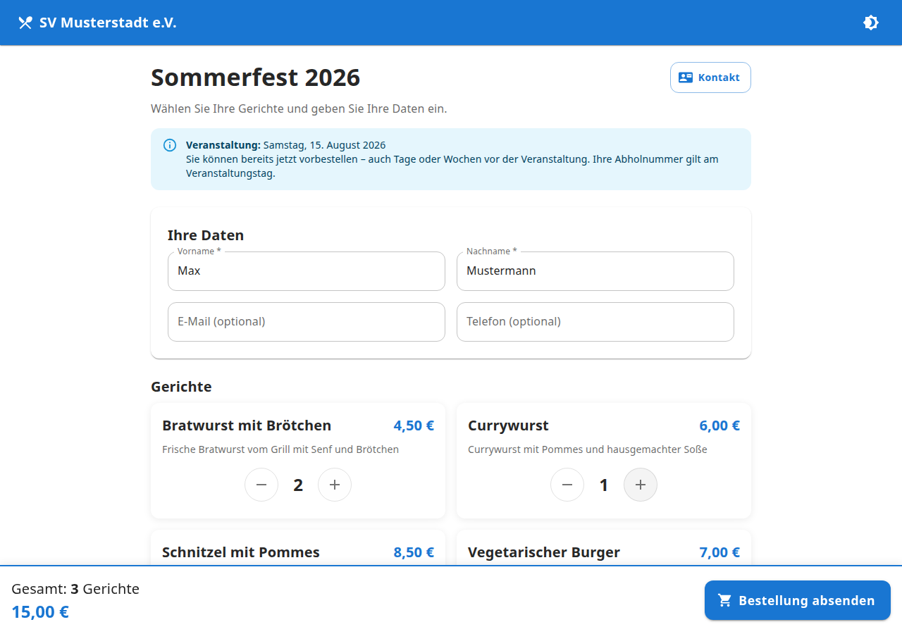

# Vereinsbestellung

Moderne Webanwendung zur Verwaltung von Essensbestellungen bei Vereinsveranstaltungen – mit Vorausbestellungen, Vereins-Branding, Echtzeit-Updates und PWA-Unterstützung.



## Funktionen auf einen Blick

| Bereich | Beschreibung |
|---------|-------------|
| **Öffentliche Bestellseite** | Ohne Registrierung, Vorausbestellungen, Kontakt-Link |
| **Kundenstatusseite** | Live-Status per WebSocket |
| **Abholboard** | Vollbild-Monitor für fertige Bestellungen |
| **Mitarbeiter-Dashboard** | Statistiken, Umsatz, beliebte Gerichte |
| **Küchenansicht** | Tablet-optimiert mit großen Buttons |
| **Abholung** | Abholung per Tages-Bestellnummer bestätigen |
| **Bestellung** | Bestellungen vor Ort aufgeben (ohne Kundendaten) |
| **Vereinseinstellungen** | Name, Logo, Kontaktdaten (Admin) |
| **Speisenverwaltung** | CRUD mit Bild-Upload (Admin) |
| **Veranstaltungsverwaltung** | Mehrere Events, eine aktiv (Admin) |

## Vorausbestellungen

Kunden können **Tage oder Wochen vor** der Veranstaltung bestellen. Die Abholnummer (001, 002, …) bezieht sich auf den **Veranstaltungstag**.

## Vereins-Branding

Administratoren können unter **Verein** (`/mitarbeiter/verein`) konfigurieren:

- Vereinsname und Logo (im Header sichtbar)
- Beschreibung, Ansprechpartner, E-Mail, Telefon, Adresse, Website
- Kontaktseite unter `/kontakt` mit Link von der Bestellseite

Ohne Konfiguration werden sinnvolle Standardwerte verwendet.

## Screenshots

### Öffentlicher Bereich

| Bestellseite | Kundenstatus | Kontakt |
|:---:|:---:|:---:|
|  |  |  |

### Monitore

| Abholboard (1920×1080) |
|:---:|
|  |

### Mitarbeiterbereich

| Dashboard | Küche (Tablet) | Abholung |
|:---:|:---:|:---:|
|  |  |  |

| Bestellung | Bestellübersicht | Vereinseinstellungen |
|:---:|:---:|:---:|
|  |  |  |

## Schnellstart

```bash
git clone https://github.com/TimUx/food-order.git
cd food-order
cp .env.example .env
docker compose up --build -d
docker compose exec backend npm run seed
```

Das Backend synchronisiert das Datenbankschema automatisch per `prisma db push` beim Start.

| Dienst | URL |
|--------|-----|
| Frontend | http://localhost:5173 |
| Bestellseite | http://localhost:5173/ |
| Kontakt | http://localhost:5173/kontakt |
| Abholboard | http://localhost:5173/abholboard |
| Mitarbeiter-Login | http://localhost:5173/mitarbeiter/login |

## Test-Zugangsdaten

| Rolle | E-Mail | Passwort |
|-------|--------|----------|
| Administrator | admin@verein.local | admin123 |
| Mitarbeiter (Küche) | kueche@verein.local | staff123 |

## Routen

### Öffentlich

| Route | Beschreibung |
|-------|-------------|
| `/` | Bestellseite |
| `/kontakt` | Kontaktdaten des Vereins |
| `/status` | Status abfragen |
| `/status/:orderId` | Live-Status |
| `/abholboard` | Abholboard für Monitore |

### Mitarbeiter

| Route | Beschreibung | Rolle |
|-------|-------------|-------|
| `/mitarbeiter/abholung` | Abholung bestätigen | ADMIN, STAFF |
| `/mitarbeiter/bestellung` | Bestellung vor Ort | ADMIN, STAFF |
| `/mitarbeiter/kueche` | Küchenansicht | ADMIN, STAFF |
| `/mitarbeiter/verein` | Vereinseinstellungen | ADMIN |

> Alte Routen `/mitarbeiter/kasse` und `/mitarbeiter/lokale-kasse` leiten automatisch weiter.

## Dokumentation

| Handbuch | Zielgruppe |
|----------|-----------|
| [Developer Guide](docs/DEVELOPER_GUIDE.md) | Entwickler |
| [Admin Guide](docs/ADMIN_GUIDE.md) | Administratoren |
| [User Guide](docs/USER_GUIDE.md) | Mitarbeiter (Küche, Abholung) |

## Technologie-Stack

React · TypeScript · Vite · Material UI · Node.js · Express · Prisma · PostgreSQL · Socket.IO · Docker · PWA

## Docker Images

Fertige Images werden per GitHub Actions in die GitHub Container Registry veröffentlicht:

- `ghcr.io/timux/food-order/backend`
- `ghcr.io/timux/food-order/frontend`

Ausführung: manuell über Actions oder automatisch beim Erstellen eines Releases.

## Screenshots aktualisieren

```bash
cd frontend && npm run build
cd .. && npm run screenshots
```
