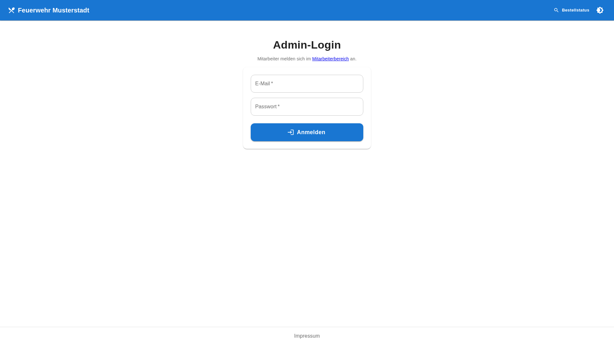
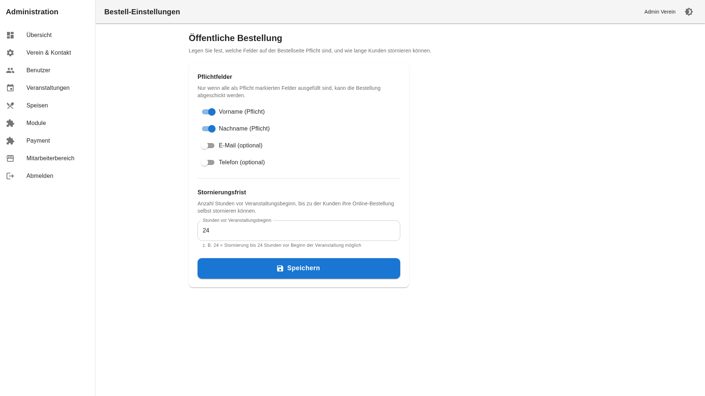
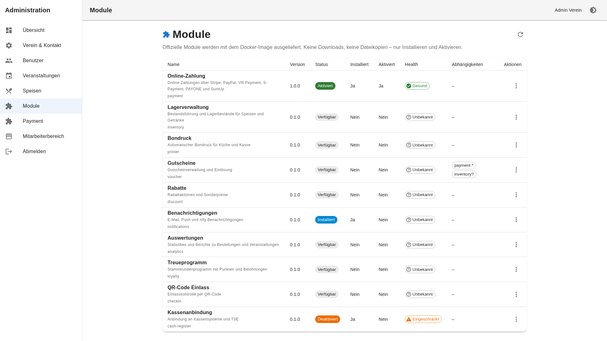
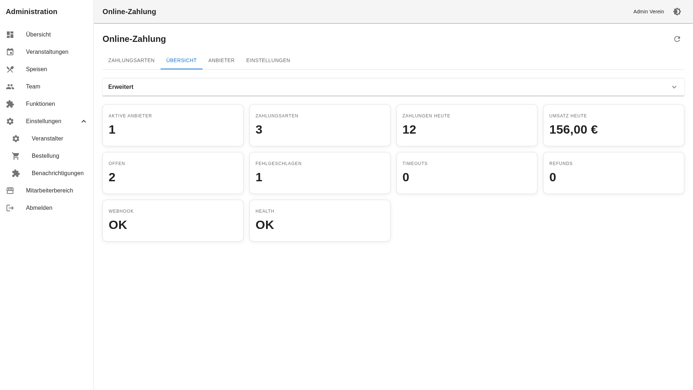
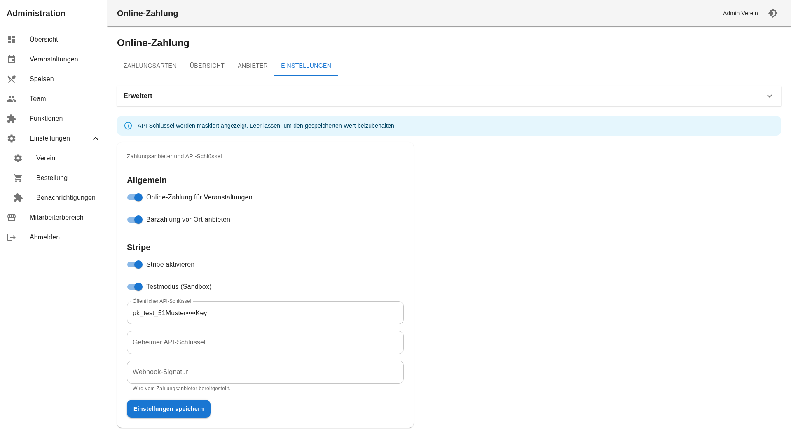
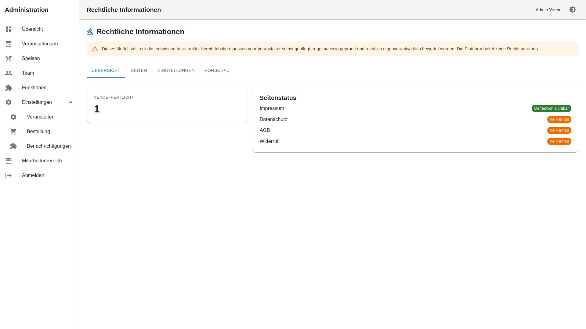
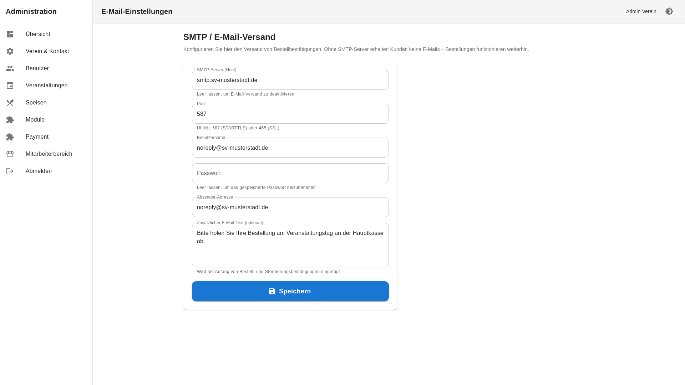
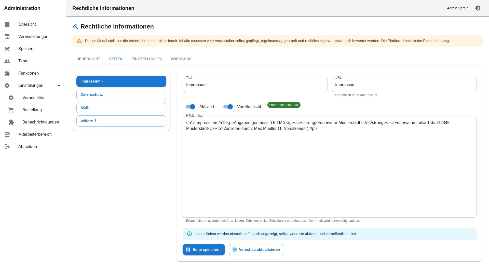
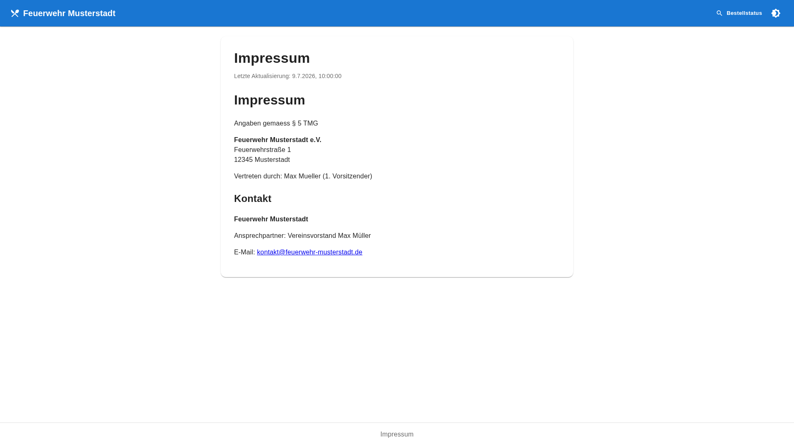

# Administratorhandbuch (Admin Guide)

Anleitung für Administratoren der FestSchmiede-Plattform mit Vollzugriff auf alle Funktionen – von der Installation bis zum Veranstaltungstag.

> **Version 2.0:** FestSchmiede ist mandantenfähig. Es gibt zwei Verwaltungsebenen:
> - **Plattform-Administration** unter `/platform` – Mandanten verwalten, System konfigurieren (nur Plattformadministratoren)
> - **Veranstalter-Administration** unter `/admin` – mandantenspezifisch (normale Administratoren)
>
> Standard-Plattformlogin: `platform@festschmiede.local` (Passwort via `PLATFORM_ADMIN_PASSWORD` in `.env`). Details: [ADR-022](architecture/022-platform-administration.md), [Phase-3-Report](architecture/PHASE_3_COMPLETION_REPORT.md).

## Plattform-Administration (Phase 3)

| Bereich | URL | Beschreibung |
|---------|-----|--------------|
| Login | `/platform/login` | Separater Einstieg für Plattformadministratoren |
| Dashboard | `/platform` | Kennzahlen, Systemstatus |
| Mandanten | `/platform/mandanten` | Anlegen, Bearbeiten, Sperren, Impersonation |
| Mandantenanträge | `/platform/bewerbungen` | Bewerbungen prüfen, genehmigen, Mandant anlegen |
| Domain & Routing | `/platform/domains` | Anzeige der kanonischen Domain- und Routing-Konfiguration (ENV) |
| Rechtliches | `/platform/rechtliches` | Impressum, Datenschutz, Nutzungsbedingungen (Plattformebene) |
| Einstellungen | `/platform/einstellungen` | Plattformweite Konfiguration inkl. Bewerbungen & Kontakt |
| **E-Mail** | `/platform/email` | **Zentraler SMTP**, Testmail, Mail-Queue, Authentifizierungsmodi (v2.1) |
| Monitoring | `/platform/monitoring` | CPU, RAM, Speicher |
| Logs | `/platform/logs` | Audit-Log mit Mandanten-Filter |

**Impersonation:** Plattformadmins können sich temporär als Mandanten-Administrator anmelden. Ein gelbes Banner zeigt den aktiven Impersonation-Modus an.

### Öffentliche Homepage & Mandantenbewerbungen

Die Marketing-Homepage ist unter `www.<platform-domain>` erreichbar. Die Plattformadministration liegt unter `app.<platform-domain>`. Bewerbungen können über `/mandant-beantragen` eingereicht werden, sofern `platform.registration.enabled` aktiv ist.

**Workflow:**

1. Antragsteller füllt das Formular aus (Organisation, Kontakt, Subdomain, Begründung).
2. System speichert den Antrag und versendet E-Mails an Plattformadministratoren und den Antragsteller (sofern SMTP konfiguriert).
3. Plattformadministrator prüft unter `/platform/bewerbungen` – Status: Neu, In Prüfung, Rückfrage, Genehmigt, Abgelehnt, Archiviert.
4. Bei Genehmigung kann optional automatisch ein Mandant mit der gewünschten Subdomain angelegt werden.

**Rechtliche Seiten:** Unter `/platform/rechtliches` pflegen Sie Impressum, Datenschutz und Nutzungsbedingungen. Es werden keine Mustertexte vorgegeben – Links erscheinen auf der Homepage nur bei veröffentlichtem Inhalt.

**Domain & Routing:** Unter `/platform/domains` sehen Sie die aktive Konfiguration (WWW, APP, Wildcard, API, CORS, reservierte Subdomains). Technisch kritische Werte werden über Docker/ENV gesetzt (`PLATFORM_DOMAIN`, `WWW_SUBDOMAIN`, `APP_SUBDOMAIN`, …).

### Zentrale E-Mail-Konfiguration (v2.1)

Ab Version 2.1.0 wird SMTP **ausschließlich** in der Plattformverwaltung unter `/platform/email` konfiguriert. Mandanten haben keine eigenen SMTP-Einstellungen mehr.

| Funktion | Beschreibung |
|----------|--------------|
| SMTP Host/Port/User/Pass | Zentrale Mailserver-Konfiguration |
| TLS/SSL | STARTTLS oder SSL (Port 465) |
| Absender & Reply-To | Plattformweite Standardwerte |
| Verbindung testen | SMTP-Verbindung prüfen |
| Testmail | Test an beliebige Adresse |
| Mail-Queue | Status der letzten 24 Stunden |

Mandanten können in den Benachrichtigungseinstellungen nur noch **Absendername** und **Reply-To** überschreiben.

### Authentifizierung (v2.1)

Der Plattformadministrator konfiguriert unter `/platform/email` den Authentifizierungsmodus:

- **Nur passwortlos** – Magic Link und Login-Code
- **Nur Passwort** – klassische Anmeldung
- **Passwort oder Magic Link** – beides (Standard bei Migration)
- **Passwort + optional Magic Link** – Passwort mit zusätzlicher passwortloser Option

### Initial-Setup-Assistent (v2.1)

Neue Mandanten durchlaufen beim ersten Admin-Login automatisch den Einrichtungsassistenten unter `/admin/einrichtung`. Der Assistent kann in der Administration über die API (`POST /api/setup/reset`) neu gestartet werden.


---

1. [Installation](#installation)
2. [Konfiguration](#konfiguration)
3. [Reverse Proxy (HTTPS)](#reverse-proxy-https)
4. [Erste Schritte nach der Installation](#erste-schritte-nach-der-installation)
5. [Administrationsbereich](#administrationsbereich)
6. [Bestell-Einstellungen](#bestell-einstellungen)
7. [E-Mail-Benachrichtigungen](#e-mail-benachrichtigungen)
8. [Veranstaltungen verwalten](#veranstaltungen-verwalten)
9. [Vorausbestellungen aktivieren](#vorausbestellungen-aktivieren)
10. [Speisen verwalten](#speisen-verwalten)
11. [Bestellungen überwachen](#bestellungen-überwachen)
12. [Mitarbeiter & Rollen](#mitarbeiter--rollen)
13. [Schalter & Einstellungen](#schalter--einstellungen)
14. [Modulverwaltung](#modulverwaltung)
15. [Online-Zahlung (Payment)](#online-zahlung-payment)
16. [Abholboard einrichten](#abholboard-einrichten)
17. [Checkliste am Veranstaltungstag](#checkliste-am-veranstaltungstag)
18. [FAQ](#faq)
19. [Troubleshooting](#troubleshooting)

---

## Installation

### Voraussetzungen

| Anforderung | Empfehlung |
|-------------|------------|
| Server / PC | Linux, Windows oder macOS mit Docker |
| Docker | Docker Engine 24+ und Docker Compose v2 |
| Netzwerk | Port 5173 (Frontend) und 3001 (API) erreichbar |
| Browser | Aktueller Chrome, Firefox, Safari oder Edge |

> **Hinweis:** Für den produktiven Betrieb empfiehlt sich ein Reverse Proxy (z. B. Traefik, nginx, Caddy) mit HTTPS vor dem Frontend. Siehe Abschnitt [Reverse Proxy (HTTPS)](#reverse-proxy-https).

### Installation mit Docker (empfohlen)

Die Anwendung nutzt fertige Images aus der GitHub Container Registry (kein lokaler Build nötig):

```bash
git clone https://github.com/TimUx/FestSchmiede.git
cd FestSchmiede
cp .env.example .env
docker compose pull
docker compose up -d
docker compose exec backend npm run seed
```

Standard-Images: `ghcr.io/timux/festschmiede/backend:latest` und `ghcr.io/timux/festschmiede/frontend:latest`  
Tag ändern über `IMAGE_TAG` in `.env` (z. B. Release-Version).

Das Backend wendet beim Start versionierte Prisma-Migrationen an (`prisma migrate deploy`). Vor Upgrades ist ein Datenbank-Backup Pflicht — siehe [OPERATIONS.md](OPERATIONS.md).

### Prüfen, ob alles läuft

```bash
docker compose ps
```

Alle drei Dienste (`postgres`, `backend`, `frontend`) sollten den Status **running** haben.

| Dienst | URL | Beschreibung |
|--------|-----|--------------|
| Frontend | http://localhost:5173 | Öffentliche Bestellseite |
| Bestellseite | http://localhost:5173/ | Kundenbestellungen |
| Kontakt | http://localhost:5173/kontakt | Vereinskontakt |
| Abholboard | http://localhost:5173/abholboard | Monitor-Anzeige |
| Mitarbeiter-Login | http://localhost:5173/mitarbeiter/login | Admin- und Mitarbeiterbereich |
| API (intern) | http://localhost:3001/api/health | Gesundheitscheck |

### Docker-Images aus der Registry (optional)

Fertige Images werden per GitHub Actions veröffentlicht:

- `ghcr.io/timux/festschmiede/backend`
- `ghcr.io/timux/festschmiede/frontend`

Auslösung: manuell über GitHub Actions oder automatisch beim Erstellen eines Releases.

### Updates einspielen

Vor jedem Update **Backup erstellen** — siehe [OPERATIONS.md — Update](OPERATIONS.md#update-durchführen).

```bash
./scripts/backup/postgres-backup.sh
docker compose pull
docker compose up -d
```

Daten in PostgreSQL und hochgeladene Bilder bleiben in Docker-Volumes erhalten.

---

## Konfiguration

Alle Einstellungen befinden sich in der Datei `.env` im Projektverzeichnis. Nach Änderungen Container neu starten:

```bash
docker compose up -d
```

### Datenbank

```env
POSTGRES_USER=verein
POSTGRES_PASSWORD=verein_secret      # In Produktion ändern!
POSTGRES_DB=vereinsbestellung
```

### Sicherheit & Authentifizierung

```env
JWT_SECRET=change-me-in-production-use-long-random-string
JWT_EXPIRES_IN=8h
CORS_ORIGIN=http://localhost:5173    # Öffentliche Frontend-URL (auch für E-Mail-Links)
```

| Variable | Beschreibung |
|----------|--------------|
| `JWT_SECRET` | Geheimer Schlüssel für Mitarbeiter-Login – **in Produktion unbedingt ändern** (min. 32 Zeichen) |
| `APP_ENCRYPTION_KEY` | Verschlüsselung für SMTP/Payment-Settings (min. 32 Zeichen) |
| `PLATFORM_ADMIN_PASSWORD` | Initiales Plattformadmin-Passwort – **Pflicht in Produktion** (min. 16 Zeichen) |
| `TRUSTED_PROXY_HOPS` | Anzahl Reverse-Proxy-Hops (z. B. `1` hinter Traefik/nginx) |
| `JWT_EXPIRES_IN` | Gültigkeitsdauer des Login-Tokens (z. B. `8h`, `24h`) |
| `CORS_ORIGIN` | Erlaubte Frontend-URL; wird auch für Links in Bestätigungs-E-Mails verwendet (bei HTTPS: `https://bestellung.sv-musterstadt.de` – siehe [Reverse Proxy](#reverse-proxy-https)) |

### Frontend-URLs (Build-Zeit)

```env
VITE_API_URL=http://localhost:3001
VITE_WS_URL=http://localhost:3001
```

Bei Docker mit eigenem Domainnamen müssen diese URLs auf die öffentlich erreichbare Adresse zeigen. **Empfehlung:** Dieselbe Domain wie das Frontend nutzen und die Werte leer lassen – der eingebaute Frontend-nginx leitet `/api/` und `/socket.io/` intern weiter (Details: [Reverse Proxy](#reverse-proxy-https)).

Nach Änderung an `VITE_*`-Variablen Frontend neu bauen:

```bash
docker compose up --build -d frontend
```

**Turnstile (Bot-Schutz):** Wenn beide Turnstile-Variablen gesetzt sind, erscheint auf der Bestellseite das Cloudflare-Widget. Nach dem Eintragen in `.env`:

```bash
docker compose up --build -d
```

(`VITE_TURNSTILE_SITE_KEY` wird beim Frontend-Build eingebettet, `TURNSTILE_SECRET_KEY` wird vom Backend zur Laufzeit gelesen.)

### E-Mail (optional)

E-Mail-Versand wird im Admin-Bereich unter **Benachrichtigungen** (`/admin/settings/module.notifications`) konfiguriert – nicht über `.env`. Die Route `/admin/email` leitet automatisch weiter.

| Feld | Beschreibung |
|------|-------------|
| SMTP-Server | Hostname des Mailservers (leer = kein Versand) |
| Port | Üblich: 587 (STARTTLS) oder 465 (SSL) |
| Benutzername / Passwort | Falls der Server Authentifizierung verlangt |
| Absender-Adresse | z. B. `noreply@ihr-verein.de` |
| Zusätzlicher E-Mail-Text | Optionaler Freitext am Anfang von Bestell- und Stornierungsmails |

Ohne SMTP-Konfiguration funktionieren Bestellungen weiterhin – Kunden erhalten dann nur keine Bestätigungs-E-Mail.

### Bot-Schutz auf der Bestellseite (optional)

```env
VITE_TURNSTILE_SITE_KEY=ihr-site-key
TURNSTILE_SECRET_KEY=ihr-secret-key
```

Cloudflare Turnstile schützt die öffentliche Bestellseite vor automatisierten Bestellungen. Ohne diese Keys greifen weiterhin Honeypot und Zeitprüfung.

### Modulsystem & Online-Zahlung (optional)

```env
# MODULES_DIR=/app/modules          # Docker: Standard /app/modules
# APP_ENCRYPTION_KEY=...            # Verschlüsselung von Secrets in der DB (min. 32 Zeichen)
```

| Variable | Beschreibung |
|----------|--------------|
| `MODULES_DIR` | Pfad zu offiziellen Modulen (Docker-Image) |
| `APP_ENCRYPTION_KEY` | AES-Schlüssel für verschlüsselte API-Keys und Passwörter in der DB |

Payment- und SMTP-Einstellungen werden **nur in der Web-Oberfläche** gespeichert – nicht in `.env`.

Ohne `APP_ENCRYPTION_KEY` wird ein Fallback aus `JWT_SECRET` verwendet – in Produktion einen eigenen Schlüssel setzen.

### Übersicht: Was muss vor dem Live-Betrieb geändert werden?

| Einstellung | Pflicht? |
|-------------|----------|
| `POSTGRES_PASSWORD` | ✅ Ja |
| `JWT_SECRET` | ✅ Ja |
| `CORS_ORIGIN` / `VITE_API_URL` / `VITE_WS_URL` | ✅ Ja (auf echte Domain) |
| Admin-Passwort (nach Seed) | ✅ Ja |
| SMTP (Benachrichtigungen) | Optional |
| Payment-Modul | Optional (nur bei Onlinezahlung) |
| `APP_ENCRYPTION_KEY` | Optional (empfohlen bei Payment/SMTP) |

---

## Reverse Proxy (HTTPS)

Für den produktiven Betrieb sollte die Plattform hinter einem Reverse Proxy mit TLS-Zertifikat erreichbar sein. In allen folgenden Beispielen verwenden wir die Beispiel-Domain **`bestellung.sv-musterstadt.de`**.

### Architektur

Das Frontend-Image enthält bereits einen nginx, der API-Anfragen, Uploads und WebSockets an das Backend weiterleitet. Der äußere Reverse Proxy muss daher **nur den Frontend-Container** ansprechen – Backend und PostgreSQL bleiben im internen Docker-Netzwerk.

```
Internet (HTTPS)
      │
      ▼
┌─────────────────────┐
│  Traefik / nginx /  │  Port 443, TLS-Terminierung
│  Caddy              │
└──────────┬──────────┘
           │ HTTP → vereins-frontend:80
           ▼
┌─────────────────────┐
│  Frontend (nginx)   │  /api/, /uploads/, /socket.io/ → Backend
└──────────┬──────────┘
           │ internes Docker-Netzwerk
           ▼
┌─────────────────────┐     ┌─────────────────────┐
│  Backend            │────▶│  PostgreSQL         │
│  (nicht öffentlich) │     │  (nicht öffentlich) │
└─────────────────────┘     └─────────────────────┘
```

### `.env` für den Betrieb hinter dem Proxy

Wenn Frontend und API über **dieselbe Domain** erreichbar sind (empfohlen), leitet der eingebaute Frontend-nginx `/api/` und `/socket.io/` intern weiter. Dann können `VITE_API_URL` und `VITE_WS_URL` leer bleiben:

```env
CORS_ORIGIN=https://bestellung.sv-musterstadt.de
VITE_API_URL=
VITE_WS_URL=
```

> **Hinweis:** `VITE_*`-Variablen werden beim **Build** des Frontend-Images eingebettet. Die vorgefertigten GHCR-Images nutzen standardmäßig `http://localhost:3001`. Für Same-Origin-Betrieb hinter dem Proxy muss das Frontend mit leeren Werten neu gebaut und veröffentlicht werden, **oder** der Reverse Proxy leitet zusätzlich `/api/` und `/socket.io/` direkt zum Backend weiter (siehe nginx-Beispiel unten).

### Ports in Produktion einschränken

In `docker-compose.yml` sind Backend (`3001`) und PostgreSQL (`5432`) standardmäßig nach außen gemappt – praktisch für lokale Entwicklung, in Produktion unnötig. Entfernen Sie die Port-Mappings oder nutzen Sie eine Override-Datei:

```yaml
# docker-compose.override.yml (nur Produktion)
services:
  postgres:
    ports: []
  backend:
    ports: []
  frontend:
    ports: []   # Traefik/nginx spricht Frontend über Docker-Netzwerk an
```

### Traefik (Docker Labels)

Traefik muss im selben Docker-Netzwerk wie die Anwendung laufen. Beispiel mit Let's Encrypt:

```yaml
# docker-compose.yml – Ergänzung am frontend-Service
services:
  frontend:
    image: ghcr.io/timux/festschmiede/frontend:latest
    container_name: vereins-frontend
    restart: unless-stopped
    networks:
      - default
      - traefik
    labels:
      - "traefik.enable=true"
      - "traefik.docker.network=traefik"
      # HTTP → HTTPS Redirect
      - "traefik.http.routers.vereinsbestellung-http.rule=Host(`bestellung.sv-musterstadt.de`)"
      - "traefik.http.routers.vereinsbestellung-http.entrypoints=web"
      - "traefik.http.routers.vereinsbestellung-http.middlewares=redirect-to-https"
      - "traefik.http.middlewares.redirect-to-https.redirectscheme.scheme=https"
      # HTTPS
      - "traefik.http.routers.vereinsbestellung.rule=Host(`bestellung.sv-musterstadt.de`)"
      - "traefik.http.routers.vereinsbestellung.entrypoints=websecure"
      - "traefik.http.routers.vereinsbestellung.tls=true"
      - "traefik.http.routers.vereinsbestellung.tls.certresolver=letsencrypt"
      - "traefik.http.services.vereinsbestellung.loadbalancer.server.port=80"

networks:
  traefik:
    external: true
```

Typische Traefik-Statik-Konfiguration (`traefik.yml`):

```yaml
entryPoints:
  web:
    address: ":80"
  websecure:
    address: ":443"

certificatesResolvers:
  letsencrypt:
    acme:
      email: admin@sv-musterstadt.de
      storage: /letsencrypt/acme.json
      httpChallenge:
        entryPoint: web

providers:
  docker:
    exposedByDefault: false
    network: traefik
```

DNS: Ein `A`- oder `CNAME`-Eintrag für `bestellung.sv-musterstadt.de` muss auf den Server zeigen, auf dem Traefik läuft.

### nginx (eigenständiger Host)

Wenn nginx direkt auf dem Host installiert ist und das Frontend über `localhost:5173` oder das Docker-Netzwerk erreichbar ist:

```nginx
# /etc/nginx/sites-available/bestellung.sv-musterstadt.de
upstream vereins_frontend {
    server 127.0.0.1:5173;   # oder: server vereins-frontend:80; bei nginx im Docker-Netzwerk
    keepalive 32;
}

server {
    listen 80;
    server_name bestellung.sv-musterstadt.de;
    return 301 https://$host$request_uri;
}

server {
    listen 443 ssl http2;
    server_name bestellung.sv-musterstadt.de;

    ssl_certificate     /etc/letsencrypt/live/bestellung.sv-musterstadt.de/fullchain.pem;
    ssl_certificate_key /etc/letsencrypt/live/bestellung.sv-musterstadt.de/privkey.pem;

    # Frontend (inkl. /api/, /uploads/, /socket.io/ – weitergeleitet durch Frontend-nginx)
    location / {
        proxy_pass http://vereins_frontend;
        proxy_http_version 1.1;
        proxy_set_header Host $host;
        proxy_set_header X-Real-IP $remote_addr;
        proxy_set_header X-Forwarded-For $proxy_add_x_forwarded_for;
        proxy_set_header X-Forwarded-Proto $scheme;
    }

    # WebSocket (zusätzliche Absicherung für /socket.io/)
    location /socket.io/ {
        proxy_pass http://vereins_frontend;
        proxy_http_version 1.1;
        proxy_set_header Upgrade $http_upgrade;
        proxy_set_header Connection "upgrade";
        proxy_set_header Host $host;
        proxy_set_header X-Real-IP $remote_addr;
        proxy_set_header X-Forwarded-For $proxy_add_x_forwarded_for;
        proxy_set_header X-Forwarded-Proto $scheme;
        proxy_read_timeout 86400;
    }
}
```

Zertifikat mit Certbot:

```bash
sudo certbot --nginx -d bestellung.sv-musterstadt.de
sudo ln -s /etc/nginx/sites-available/bestellung.sv-musterstadt.de /etc/nginx/sites-enabled/
sudo nginx -t && sudo systemctl reload nginx
```

**Alternative:** API und WebSocket direkt zum Backend leiten (wenn `VITE_API_URL` / `VITE_WS_URL` auf die Domain zeigen):

```nginx
location /api/ {
    proxy_pass http://127.0.0.1:3001/api/;
    proxy_set_header Host $host;
    proxy_set_header X-Real-IP $remote_addr;
    proxy_set_header X-Forwarded-For $proxy_add_x_forwarded_for;
    proxy_set_header X-Forwarded-Proto $scheme;
}

location /uploads/ {
    proxy_pass http://127.0.0.1:3001/uploads/;
}

location /socket.io/ {
    proxy_pass http://127.0.0.1:3001/socket.io/;
    proxy_http_version 1.1;
    proxy_set_header Upgrade $http_upgrade;
    proxy_set_header Connection "upgrade";
    proxy_set_header Host $host;
    proxy_read_timeout 86400;
}
```

### Caddy

Caddy übernimmt TLS automatisch (Let's Encrypt):

```caddy
# /etc/caddy/Caddyfile
bestellung.sv-musterstadt.de {
    reverse_proxy vereins-frontend:80 {
        header_up Host {host}
        header_up X-Real-IP {remote_host}
        header_up X-Forwarded-For {remote_host}
        header_up X-Forwarded-Proto {scheme}
    }
}
```

Wenn Caddy auf dem Host läuft und Docker-Container per Published Port erreichbar sind:

```caddy
bestellung.sv-musterstadt.de {
    reverse_proxy localhost:5173
}
```

Caddy leitet WebSocket-Upgrades standardmäßig korrekt weiter – eine separate `location` für `/socket.io/` ist nicht nötig.

Caddy neu laden:

```bash
sudo caddy validate --config /etc/caddy/Caddyfile
sudo systemctl reload caddy
```

### Checkliste Reverse Proxy

| Schritt | Erledigt? |
|---------|-----------|
| DNS-Eintrag `bestellung.sv-musterstadt.de` → Server-IP | ☐ |
| TLS-Zertifikat aktiv (HTTPS) | ☐ |
| Nur Frontend öffentlich erreichbar (Backend/DB intern) | ☐ |
| `CORS_ORIGIN=https://bestellung.sv-musterstadt.de` in `.env` | ☐ |
| `VITE_API_URL` / `VITE_WS_URL` passend gesetzt (leer = Same-Origin) | ☐ |
| WebSocket-Verbindung getestet (Küche, Dashboard, Abholboard) | ☐ |
| Testbestellung über HTTPS durchgeführt | ☐ |

### Häufige Probleme

| Symptom | Ursache | Lösung |
|---------|---------|--------|
| Login schlägt fehl, CORS-Fehler in der Browser-Konsole | `CORS_ORIGIN` stimmt nicht mit der öffentlichen URL überein | Exakte HTTPS-URL in `.env` setzen, Backend neu starten |
| Küche/Dashboard ohne Live-Updates | WebSocket blockiert oder falsche `VITE_WS_URL` | `wss://`-Weiterleitung prüfen; bei Same-Origin `VITE_WS_URL` leer lassen |
| Gemischte Inhalte (Mixed Content) | HTTP-API hinter HTTPS-Seite | `VITE_API_URL` auf `https://…` oder leer (Same-Origin) setzen |
| 502 Bad Gateway | Frontend-Container nicht erreichbar | `docker compose ps`, Netzwerk/Firewall prüfen |

---

## Erste Schritte nach der Installation

### 1. Anmeldung (Administrationsbereich)

1. Öffnen Sie `/admin/login`
2. Melden Sie sich mit den **von Ihnen vergebenen** Admin-Zugangsdaten an (nach dem ersten Seed Passwörter ändern — Demo-Zugänge nur für Entwicklung, siehe [Developer Guide](DEVELOPER_GUIDE.md#test-zugangsdaten))
3. Nach dem Login gelangen Sie zur Admin-Übersicht

> **Wichtig:** Ändern Sie alle Standard-Passwörter vor dem produktiven Einsatz! Mitarbeiter melden sich unter `/mitarbeiter/login` an.




### 2. Verein einrichten

Navigieren Sie zu **Veranstalter** (`/admin/verein`) und tragen Sie ein:

- Name des Veranstalters und Logo
- Kontaktdaten für die öffentliche Kontaktseite und Bestätigungs-E-Mails


### 3. Bestell-Einstellungen konfigurieren

Unter **Bestellung** (`/admin/bestellung`) legen Sie fest:

- Welche Felder auf der öffentlichen Bestellseite **Pflicht** oder **optional** sind (Vorname, Nachname, E-Mail, Telefon)
- Die **Stornierungsfrist** in Stunden vor Veranstaltungsbeginn



### 4. Benutzer anlegen

Unter `/admin/benutzer` können Sie weitere Mitarbeiter und Administratoren anlegen.


### 5. Erste Veranstaltung anlegen

Unter **Veranstaltungen** (`/admin/veranstaltungen`) eine Veranstaltung mit korrektem **Veranstaltungsdatum** anlegen und **aktivieren**.

### 6. Speisen pflegen

Unter **Speisen** (`/admin/speisen`) Gerichte für die aktive Veranstaltung anlegen.

### 7. Testbestellung durchführen

Öffnen Sie die öffentliche Bestellseite (`/`), geben Sie eine Testbestellung auf und prüfen Sie, ob sie in der Küchenansicht erscheint.

---

## Administrationsbereich

Der **Administrationsbereich** (`/admin`) ist vom Mitarbeiterbereich getrennt und nur für Administratoren zugänglich.

| Route | Funktion |
|-------|----------|
| `/admin/login` | Admin-Anmeldung |
| `/admin` | Übersicht |
| `/admin/verein` | Veranstalter: Name, Logo, Kontaktdaten |
| `/admin/benutzer` | Benutzerverwaltung (anlegen, bearbeiten, deaktivieren) |
| `/admin/veranstaltungen` | Veranstaltungen verwalten |
| `/admin/speisen` | Speisekarte pflegen |
| `/admin/bestellung` | Pflichtfelder & Stornierungsfrist |
| `/admin/settings/module.notifications` | E-Mail & Benachrichtigungskanäle |
| `/admin/module` | Modulverwaltung (installieren, aktivieren) |
| `/admin/payment` | Payment-Administration (Dashboard, Provider, Zahlungen) |
| `/admin/legal` | Rechtliche Informationen (Impressum, Datenschutz, AGB, Widerruf) |

Legacy-Weiterleitungen: `/admin/email` → Benachrichtigungen · `/admin/module/payment` → `/admin/payment`

Der **Mitarbeiterbereich** (`/mitarbeiter`) bleibt für den operativen Betrieb: Dashboard, Küche, Abholung, Bestellung, Bestellübersicht.


| Bereich | Screenshot |
|---------|------------|
| Admin-Login |  |
| Veranstalter |  |
| Bestell-Einstellungen |  |
| Benutzerverwaltung |  |
| Veranstaltungen |  |
| Speisen |  |
| Modulverwaltung |  |
| Payment-Admin |  |
| Payment-Einstellungen |  |
| Rechtliche Informationen |  |

---

## Bestell-Einstellungen

Navigieren Sie zu **Bestellung** (`/admin/bestellung`).


### Pflichtfelder

Legen Sie fest, welche Kundendaten auf der öffentlichen Bestellseite erforderlich sind:

| Feld | Standard |
|------|----------|
| Vorname | Pflicht |
| Nachname | Pflicht |
| E-Mail | Optional |
| Telefon | Optional |

Nur wenn alle als Pflicht markierten Felder ausgefüllt sind, kann die Bestellung abgeschickt werden.

### Stornierungsfrist

Geben Sie an, wie viele **Stunden vor Veranstaltungsbeginn** Kunden ihre Online-Bestellung selbst stornieren können (Standard: 24 Stunden).

Beispiel: Veranstaltung beginnt Samstag um 11:00 Uhr, Stornierungsfrist 24 h → Stornierung möglich bis Freitag 11:00 Uhr.

Kunden stornieren über die Statusseite (`/status/:orderId`) mit Nachnamen zur Bestätigung. Stornierung ist nur bei Status **Neu** oder **In Bearbeitung** möglich.

---

## E-Mail-Benachrichtigungen

Navigieren Sie zu **Benachrichtigungen** (`/admin/settings/module.notifications`). Legacy-Route `/admin/email` leitet automatisch weiter.



### SMTP-Server

Tragen Sie die Zugangsdaten Ihres SMTP-Servers ein. Das Passwort wird in der Datenbank gespeichert und beim Laden nicht angezeigt – ein leeres Passwortfeld beim Speichern lässt das bestehende Passwort unverändert.

| Feld | Beschreibung |
|------|-------------|
| SMTP-Server | Hostname des Mailservers (leer = kein Versand) |
| Port | Üblich: 587 (STARTTLS) oder 465 (SSL) |
| Benutzername / Passwort | Falls der Server Authentifizierung verlangt |
| Absender-Adresse | z. B. `noreply@ihr-verein.de` |
| Absendername | Anzeigename in E-Mails |
| Reply-To | Antwortadresse für Kunden |
| SMTP-Quelle | Eigener Server oder Plattform-SMTP (Fallback) |
| SSL / STARTTLS | Port 465 (SSL) oder 587 (STARTTLS) |

Unter **Branding & Absender** konfigurieren Sie Logo, Primärfarbe, Footer und Signatur für E-Mails.

Weitere Kanäle (ntfy, Discord, Slack, Teams) konfigurieren Sie auf derselben Seite.

Die Links in Bestätigungs-E-Mails verwenden die mandantenspezifische öffentliche URL (Subdomain oder Pfad-Präfix).

### Inhalt der E-Mails

Wenn Kunden eine E-Mail angeben (Pflichtfeld oder optional), erhalten sie eine Bestellbestätigung mit:

- Abholnummer und Veranstaltungstag
- Veranstalterdaten (Name, Kontaktdaten des Verkäufers)
- Bestellte Gerichte und Gesamtpreis
- Rechtlicher Hinweis zum verbindlichen Kaufvertrag und zur Abrechnung nicht abgeholter Bestellungen
- Link zur Status- und Stornierungsseite

Bei Stornierung erhalten Kunden zusätzlich eine **Stornierungsbestätigung** mit stornierten Gerichten, Zeitpunkt der Stornierung und Hinweis zur Vertragsaufhebung (sowohl bei Selbststornierung als auch bei Stornierung durch Mitarbeiter).

---

## Veranstaltungen verwalten

Navigieren Sie zu **Veranstaltungen** (`/admin/veranstaltungen`).


### Neue Veranstaltung anlegen

1. Klicken Sie auf **Neue Veranstaltung**
2. Füllen Sie aus:
   - **Name** – z. B. „Sommerfest 2026"
   - **Beschreibung** – optionale Info für interne Zwecke
   - **Datum** – der Veranstaltungstag (entscheidend für Abholnummern!)
   - **Beginn / Ende** – Öffnungszeiten
3. Speichern

### Veranstaltung aktivieren

Es kann **immer genau eine** Veranstaltung aktiv sein. Klicken Sie bei der gewünschten Veranstaltung auf **Aktivieren**.

Die aktive Veranstaltung bestimmt:
- Welche Speisekarte öffentlich sichtbar ist
- Für welches Event Bestellungen angenommen werden
- Welche Bestellnummern vergeben werden

---

## Vorausbestellungen aktivieren

Kunden können **Tage oder Wochen vor** der Veranstaltung bestellen.

### So funktioniert es

1. Legen Sie die Veranstaltung mit dem **korrekten Veranstaltungsdatum** an
2. Aktivieren Sie die Veranstaltung
3. Schalten Sie **Onlinebestellungen aktiv** ein
4. Stellen Sie sicher, dass **Bestellungen geschlossen** aus ist

Die öffentliche Bestellseite zeigt dann z. B.:

> *Samstag, 15. August 2026 · Vorbestellung möglich*


Die Bestellseite ist für Touch-Bedienung auf Smartphone und Tablet optimiert:

| Monitor | iPhone | iPad |
|:---:|:---:|:---:|
|  |  |  |

### Wichtige Regeln

| Aspekt | Verhalten |
|--------|-----------|
| Abholnummer | Gilt am **Veranstaltungstag** (001, 002, …) |
| Bestellzeitpunkt | Beliebig vor der Veranstaltung |
| Küche | Sieht am Event-Tag alle Vorbestellungen |
| Abholung | Funktioniert am Veranstaltungstag per Abholnummer |

---

## Speisen verwalten

Navigieren Sie zu **Speisen** (`/admin/speisen`).


### Gericht anlegen

| Feld | Beschreibung |
|------|-------------|
| Name | Anzeigename auf der Bestellseite |
| Beschreibung | Kurzbeschreibung für Kunden |
| Preis | in Euro |
| Reihenfolge | Sortierung (1 = oben) |
| Aktiv | Sichtbar auf der Bestellseite |
| Ausverkauft | Temporär nicht bestellbar |
| Max. Bestellmenge | Optional, pro Bestellung |

### Bild hochladen

Klicken Sie beim Gericht auf das Kamera-Symbol und wählen Sie ein Bild (JPEG, PNG, WebP, max. 5 MB).

---

## Bestellungen überwachen

### Dashboard


Zeigt live:
- Anzahl Bestellungen (gesamt, offen, fertig, abgeholt)
- Umsatz
- Durchschnittliche Bearbeitungszeit
- Schnellzugriff auf Abholung und Bestellung

### Bestellübersicht


Alle Bestellungen chronologisch – mit **Name, E-Mail und Telefonnummer** (bei Online-Bestellungen) für Rückfragen.

```
Neu → In Bearbeitung → Fertig → Abgeholt
                         ↓
                    Storniert
```

---

## Mitarbeiter & Rollen

| Rolle | Bereich | Berechtigungen |
|-------|---------|---------------|
| **ADMIN** | `/admin` + `/mitarbeiter` | Verein, Benutzer, Veranstaltungen, Speisen + operativer Betrieb |
| **STAFF** | `/mitarbeiter` | Küche, Abholung, Bestellung, Bestellungen, Dashboard |

Benutzer werden unter `/admin/benutzer` angelegt und verwaltet.

---

## Schalter & Einstellungen

Pro Veranstaltung drei Schalter:

| Schalter | Wirkung |
|----------|---------|
| **Onlinebestellungen aktiv** | Öffentliche Bestellseite erreichbar |
| **Bestellung vor Ort aktiv** | Mitarbeiter können Bestellungen vor Ort aufgeben |
| **Bestellungen geschlossen** | Keine neuen Bestellungen |

### Typische Szenarien

| Situation | Online | Vor Ort | Geschlossen |
|---------|--------|---------|-------------|
| Vorbestellphase (2 Wochen vorher) | ✅ | ❌ | ❌ |
| Veranstaltungstag | ✅ | ✅ | ❌ |
| Ausverkauf / Ende | ❌ | ❌ | ✅ |

---

## Modulverwaltung

Unter **Module** (`/admin/module`) verwalten Sie optionale Erweiterungen der Plattform. Module werden **mit dem Docker-Image ausgeliefert** – es gibt keine separaten Downloads.

> **Multi-Tenant (Phase 4):** Module werden plattformweit bereitgestellt, aber **pro Veranstalter (Mandant)** installiert und aktiviert. Einstellungen und Daten (z. B. Zahlungen, E-Mails, rechtliche Texte) sind vollständig mandantenisoliert. Details: [Phase-4-Report](architecture/PHASE_4_COMPLETION_REPORT.md).


### Verfügbare Module

| Modul | Status | Beschreibung |
|-------|--------|--------------|
| **Online-Zahlung** (`payment`) | Vollständig | Stripe-Checkout, Webhooks, Rückerstattungen |
| Lagerverwaltung (`inventory`) | Geplant | Bestandsführung für Speisen |
| Bondruck (`printer`) | Geplant | Automatischer Küchen- und Kassenbondruck |
| Gutscheine (`voucher`) | Geplant | Gutscheinverwaltung (benötigt Payment) |
| Rabatte (`discount`) | Geplant | Rabattaktionen und Sonderpreise |
| **Benachrichtigungen** (`notifications`) | Vollständig | SMTP, ntfy, Discord, Slack, Teams |
| **Rechtliche Informationen** (`legal`) | Vollständig | Impressum, Datenschutz, AGB, Widerruf |
| Auswertungen (`analytics`) | Geplant | Statistiken und Berichte |
| Treueprogramm (`loyalty`) | Geplant | Punkte und Belohnungen |
| QR-Code Einlass (`checkin`) | Geplant | Einlasskontrolle per QR-Code |
| Kassenanbindung (`cash-register`) | Geplant | Anbindung an Kassensysteme und TSE |

### Lifecycle

| Status | Bedeutung |
|--------|-----------|
| **Verfügbar** | Im Image enthalten, noch nicht installiert |
| **Installiert** | Datenbank initialisiert, noch nicht aktiv |
| **Aktiviert** | Modul läuft, Menüs und Funktionen sichtbar |
| **Deaktiviert** | Installiert, aber ausgeschaltet |
| **Deinstalliert** | Zurückgesetzt, kann erneut installiert werden |

### Aktionen

| Aktion | Wirkung |
|--------|---------|
| **Installieren** | Führt Modul-Migrationen aus, speichert Standard-Konfiguration |
| **Aktivieren** | Registriert Menüs, API-Routen und Extension Points |
| **Deaktivieren** | Schaltet Modul ab, entfernt Menüs und aktive Funktionen |
| **Deinstallieren** | Setzt Installationsstatus zurück (nur wenn deaktiviert) |
| **Health Check** | Prüft Konfiguration und externe Verbindungen |

> **Wichtig für Vereine mit reiner Barzahlung:** Kein Modul muss installiert oder aktiviert werden. Ohne aktiviertes Payment-Modul verhält sich die Plattform exakt wie zuvor – Bestellungen gehen direkt an die Küche, Zahlung erfolgt an der Kasse.

### Rechtliche Informationen

Nach Installation und Aktivierung erscheint **Administration → Module → Rechtliche Informationen** (`/admin/legal`).


Das Modul verwaltet:

- Impressum
- Datenschutzerklärung
- Allgemeine Geschäftsbedingungen (AGB)
- Widerrufsbelehrung

Jede Seite besitzt:

- Aktiviert
- Veröffentlicht
- Titel
- URL-Slug
- HTML-Inhalt
- Letzte Änderung

Eine Seite wird nur öffentlich angezeigt, wenn das Modul aktiv ist, die Seite aktiviert und veröffentlicht ist und Inhalt enthält. Veröffentlichte Seiten erscheinen automatisch:

- im Footer der Bestellseite
- als öffentliche Route wie `/impressum` oder `/datenschutz`
- in Benachrichtigungs-E-Mails (wenn aktiviert)

> **Wichtig:** Das Modul liefert keine Mustertexte und keine Rechtsberatung. Inhalte müssen vom Verein selbst gepflegt und regelmäßig geprüft werden.



Öffentliche Rechtsseite (Beispiel Impressum):



### Abhängigkeiten

Manche Module benötigen andere Module. Beispiel: **Gutscheine** erfordert **Online-Zahlung**. Die Aktivierung schlägt fehl, wenn Abhängigkeiten nicht erfüllt sind.

---

## Online-Zahlung (Payment)

Das Payment-Modul ermöglicht **Onlinezahlungen** bei Vorbestellungen und im Kassenmodus. Nach Installation und Aktivierung erscheint **Administration → Module → Payment** (`/admin/payment`).


### Admin-Bereich Payment

| Tab | Inhalt |
|-----|--------|
| **Übersicht** | Dashboard: Umsatz, offene/fehlgeschlagene Zahlungen, Health |
| **Provider** | Stripe & weitere Anbieter, Verbindung testen, aktivieren |
| **Zahlungsarten** | Welche Methoden Besuchern angezeigt werden (Smart Payment) |
| **Einstellungen** | API-Schlüssel (verschlüsselt, maskiert) |
| **Zahlungen** | Liste, Filter, Detail, Export |
| **Refunds** | Rückerstattungen mit Audit-Log |
| **Logs / Webhooks / Health / Statistiken** | Monitoring |


### Voraussetzungen

1. Modul **Online-Zahlung** installieren und aktivieren
2. Stripe-Konto (Test oder Live) einrichten
3. Optional: `APP_ENCRYPTION_KEY` in `.env` für verschlüsselte Speicherung

**Wichtig:** Stripe-Keys werden **nur in der Web-Oberfläche** konfiguriert – nicht in `.env` oder Docker-Compose.

### Provider

| Provider | Status |
|----------|--------|
| **Stripe** | Vollständig implementiert |
| PayPal, VR Payment, S-Payment, PAYONE, SumUp | Platzhalter (kommende Versionen) |

### Stripe einrichten

1. Öffnen Sie **Administration → Module → Payment → Einstellungen**
2. Schalten Sie **Stripe aktivieren** ein
3. Tragen Sie ein:
   - **Öffentlicher API-Schlüssel** (`pk_test_…` oder `pk_live_…`)
   - **Geheimer API-Schlüssel** (`sk_test_…` oder `sk_live_…`) – wird maskiert gespeichert
   - **Webhook-Signatur** (`whsec_…`) – Hinweistext erklärt die Bedeutung
4. **Testmodus (Sandbox)** für Tests aktiv lassen, für Live-Betrieb deaktivieren
5. Unter Tab **Provider** auf **Verbindung testen** klicken
6. Unter Tab **Zahlungsarten** gewünschte Methoden aktivieren (z. B. Kreditkarte, Apple Pay)
7. Speichern

### Webhook in Stripe

Tragen Sie im Stripe-Dashboard unter **Webhooks** die angezeigte URL ein:

```
https://ihre-domain.de/api/modules/features/payment/webhooks/stripe
```

Ereignisse: `checkout.session.completed`, `checkout.session.async_payment_succeeded`, `checkout.session.expired`

### Ablauf mit Onlinezahlung

1. Kunde bestellt auf der öffentlichen Bestellseite (Smart Payment: Bar oder Online)
2. Bei Onlinewahl: QR-Code / Link zur Zahlung, Live-Status auf der Bestellseite
3. Nach erfolgreicher Zahlung erscheint die Bestellung in der Küche
4. Im Kassenmodus: Vollbild-QR für den Kunden, Barzahlung weiterhin Standard
5. Unbezahlte Online-Bestellungen werden **nicht** an die Küche übergeben

### Ablauf ohne Onlinezahlung (Standard)

Wenn das Payment-Modul **nicht aktiviert** ist oder kein Provider konfiguriert wurde:

- Keine Weiterleitung zur Zahlung
- Bestellungen gehen sofort an die Küche
- Zahlung erfolgt an der Kasse beim Abholen

### FAQ Payment

**Muss ich Onlinezahlung nutzen?**  
Nein. Für Vereine mit ausschließlich Barzahlung an der Kasse ist keine Konfiguration nötig.

**Kann ich Onlinezahlung später aktivieren?**  
Ja. Modul installieren, Stripe konfigurieren, aktivieren – bestehende Bestellungen sind nicht betroffen.

**Was passiert bei Zahlungsabbruch?**  
Die Bestellung bleibt in der Datenbank, erreicht aber nicht die Küche, bis die Zahlung abgeschlossen ist.

---

## Abholboard einrichten

Das Abholboard (`/abholboard`) ist für Fernseher oder Monitore gedacht.


### Einrichtung

1. Öffnen Sie `/abholboard` auf dem Monitor-PC
2. Vollbildmodus aktivieren (F11)
3. Die Anzeige aktualisiert sich automatisch per WebSocket

### Anzeige

- Nur Bestellungen mit Status **Fertig**
- Nur die Abholnummer (groß und gut lesbar)
- Verschwindet automatisch nach Abholung
- Akustisches Signal bei neuen fertigen Bestellungen

---

## Checkliste am Veranstaltungstag

- [ ] Richtige Veranstaltung ist **aktiviert**
- [ ] Online- und Kassenbestellungen nach Bedarf **aktiviert**
- [ ] Küchen-Tablet zeigt `/mitarbeiter/kueche`
- [ ] Abholung zeigt `/mitarbeiter/abholung`
- [ ] Bestellung vor Ort unter `/mitarbeiter/bestellung`
- [ ] Abholboard auf Monitor: `/abholboard`
- [ ] Alle Vorbestellungen sind in der Küchenansicht sichtbar
- [ ] Testbestellung durchgeführt
- [ ] Bei Onlinezahlung: Payment-Modul aktiviert, Stripe-Webhook eingerichtet, Testzahlung erfolgreich

---

## FAQ

### Kann ich mehrere Veranstaltungen gleichzeitig aktiv haben?

Nein. Es ist immer genau **eine** Veranstaltung aktiv. Diese steuert Speisekarte, Bestellannahme und Abholnummern.

### Wann beginnen die Abholnummern bei 001?

Die Nummerierung (001, 002, …) bezieht sich auf den **Veranstaltungstag**, nicht auf den Bestellzeitpunkt. Vorbestellungen erhalten bereits vorher ihre Nummer für diesen Tag.

### Können Kunden ohne E-Mail bestellen?

Ja, sofern E-Mail nicht als Pflichtfeld konfiguriert ist. Vor- und Nachname sind standardmäßig Pflicht; die Pflichtfelder können unter `/admin/bestellung` angepasst werden.

### Können Kunden ihre Bestellung selbst stornieren?

Ja. Auf der Statusseite (`/status/:orderId`) können Kunden innerhalb der konfigurierten Stornierungsfrist stornieren. Dazu ist die Eingabe des Nachnamens zur Bestätigung erforderlich. Stornierung ist nur bei Status **Neu** oder **In Bearbeitung** möglich.

### Wie schütze ich die Bestellseite vor Bots?

Standardmäßig sind Honeypot und Zeitprüfung aktiv. Für zusätzlichen Schutz kann Cloudflare Turnstile in der `.env` konfiguriert werden (siehe [Konfiguration](#konfiguration)).

### Werden Bestellungen in Echtzeit aktualisiert?

Ja. Küche, Dashboard, Kundenstatus und Abholboard nutzen WebSocket-Verbindungen. Bei Verbindungsproblemen hilft ein Seiten-Reload.

### Kann ich die App auf Tablets installieren?

Ja. Die Anwendung ist als PWA nutzbar: Im Browser **Zum Startbildschirm hinzufügen** wählen (besonders praktisch für Küche, Abholung und Bestellung).

### Wie lege ich neue Mitarbeiter an?

Unter `/admin/benutzer` → **Neuer Benutzer**. Rolle „Mitarbeiter“ für Küche/Abholung, „Administrator“ für den Admin-Bereich.

### Was passiert mit hochgeladenen Speisebildern bei einem Update?

Bilder liegen im Docker-Volume `uploads_data` und bleiben bei Updates erhalten, solange das Volume nicht gelöscht wird.

### Funktioniert die Plattform ohne Internet?

Für den lokalen Betrieb im Vereinsnetz reicht das interne Netzwerk. Für E-Mail-Benachrichtigungen, optionalen Turnstile-Schutz und Onlinezahlung (Stripe) wird Internet benötigt.

### Muss ich Module installieren?

Nein. Module sind optional. Vereine mit reiner Barzahlung können alle Module deaktiviert lassen – die Plattform funktioniert dann wie gewohnt.

### Wie aktiviere ich Onlinezahlung?

1. **Administration → Module** → Online-Zahlung installieren und aktivieren
2. **Administration → Module → Payment** → Stripe konfigurieren
3. Webhook in Stripe einrichten (siehe [Online-Zahlung](#online-zahlung-payment))

---

## Troubleshooting

### Die Bestellseite zeigt „Derzeit sind keine Bestellungen möglich"

**Mögliche Ursachen:**

| Ursache | Lösung |
|---------|--------|
| Keine Veranstaltung aktiv | Veranstaltung anlegen und **aktivieren** |
| Onlinebestellungen aus | Schalter **Onlinebestellungen aktiv** einschalten |
| Bestellungen geschlossen | Schalter **Bestellungen geschlossen** ausschalten |
| Keine aktiven Speisen | Unter **Speisen** Gerichte anlegen und auf **Aktiv** setzen |

### Login funktioniert nicht

1. Prüfen Sie E-Mail und Passwort (Groß-/Kleinschreibung beachten)
2. Container-Status prüfen: `docker compose ps`
3. Backend-Logs prüfen: `docker compose logs backend --tail 50`
4. Nach frischer Installation: `docker compose exec backend npm run seed` ausführen

### Küche / Dashboard zeigt keine Live-Updates

1. Seite neu laden
2. Prüfen, ob `VITE_WS_URL` in `.env` korrekt ist (leer bei Same-Origin hinter Reverse Proxy)
3. Bei HTTPS: sicherstellen, dass WebSocket-Verbindungen (`wss://`) durch den Reverse Proxy erlaubt sind – siehe [Reverse Proxy](#reverse-proxy-https)
4. Firewall: Backend-Port 3001 sollte in Produktion **nicht** öffentlich sein; WebSocket läuft über `/socket.io/` am Frontend

### Abholboard zeigt keine fertigen Bestellungen

1. Bestellung muss den Status **Fertig** haben (in Küche oder Bestellübersicht setzen)
2. Abholboard-Seite neu laden
3. Gleiche aktive Veranstaltung wie in der Küche verwenden

### E-Mails kommen nicht an

1. SMTP-Einstellungen unter `/admin/settings/module.notifications` prüfen
2. Backend nach Änderung neu starten: `docker compose up -d backend`
3. Logs prüfen: `docker compose logs backend | grep -i mail`
4. Spam-Ordner des Empfängers prüfen

### Bilder von Speisen werden nicht angezeigt

1. Dateiformat: JPEG, PNG oder WebP, max. 5 MB
2. Upload-Volume prüfen: `docker volume ls | grep uploads`
3. Backend-Logs auf Fehler beim Upload prüfen

### Container starten nicht / Datenbankfehler

```bash
docker compose down
docker compose up -d postgres
# Warten bis postgres healthy ist
docker compose up -d
```

Bei anhaltenden Problemen Logs aller Dienste prüfen:

```bash
docker compose logs --tail 100
```

### Daten zurücksetzen (Vorsicht – löscht alle Bestellungen!)

```bash
docker compose down -v
docker compose up --build -d
docker compose exec backend npm run seed
```

> **Achtung:** `-v` löscht alle Docker-Volumes inklusive Datenbank und Uploads.

### Nützliche Befehle

| Befehl | Zweck |
|--------|-------|
| `docker compose ps` | Status aller Dienste |
| `docker compose logs -f backend` | Backend-Logs live |
| `docker compose restart backend` | Backend neu starten |
| `docker compose exec backend npm run seed` | Beispieldaten laden |
| `curl http://localhost:3001/api/health` | API erreichbar? |

---

## Support & Dokumentation

- [Benutzerhandbuch (Mitarbeiter)](USER_GUIDE.md)
- [Entwicklerhandbuch](DEVELOPER_GUIDE.md)
- [Modul-Architektur](MODULE_ARCHITECTURE.md)
- [README](../README.md)
