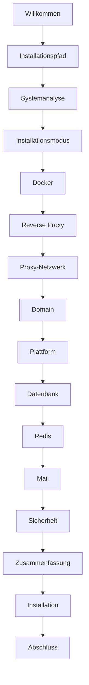

# FestSchmiede – Installationsanleitung

> **Version 2.4.0** – Pfad-basiertes Mandanten-Routing

## Schnellstart

### Online (ohne Git-Clone)

```bash
curl -fsSL https://raw.githubusercontent.com/TimUx/FestSchmiede/v2.4.0/install.sh | bash
```

**Installationspfad angeben** (Priorität: `--dir` > `FESTSCHMIEDE_INSTALL_DIR` > interaktive Abfrage > Default):

Beim normalen Ablauf (`curl | bash` oder `./install.sh`) erscheint ein Dialog zur Pfadauswahl — der Standard (`/opt/festschmiede` als root, sonst `~/festschmiede`) ist nur ein Vorschlag und kann geändert werden.

```bash
# Option 1: Kommandozeilen-Option
./install.sh -d /opt/festschmiede

# Option 2: Umgebungsvariable
FESTSCHMIEDE_INSTALL_DIR=/opt/festschmiede curl -fsSL .../install.sh | bash

# Option 3: Bei Online-Installation Argumente durchreichen
curl -fsSL .../install.sh | bash -s -- -d /opt/festschmiede

# Option 4: Eigenen Standard-Pfad vorgeben
FESTSCHMIEDE_DEFAULT_INSTALL_DIR=/srv/festschmiede curl -fsSL .../install.sh | bash
```

Standard-Installationsverzeichnis (wenn nichts angegeben):

| Benutzer | Pfad |
|----------|------|
| normaler Benutzer | `~/festschmiede` |
| root | `/opt/festschmiede` |

### Nach Git-Clone

```bash
git clone https://github.com/TimUx/FestSchmiede.git
cd FestSchmiede
./install.sh
```

Der Assistent führt Sie Schritt für Schritt durch die komplette Installation.

## Voraussetzungen

| Anforderung | Minimum | Empfohlen |
|-------------|---------|-----------|
| Betriebssystem | Debian 11+, Ubuntu 20.04+ | Debian 12 / Ubuntu 24.04 |
| RAM | 2 GB | 4 GB+ |
| CPU | 2 Kerne | 4 Kerne |
| Festplatte | 10 GB | 20 GB+ |
| Docker | 24+ (wird ggf. installiert) | Docker CE aktuell |
| Docker Compose | v2 | v2 |

Optional: `dialog` oder `gum` für die TUI-Oberfläche (Debian/Ubuntu: `dialog` ist standardmäßig vorhanden).

## Installations-Assistent

### Ablauf



### Schritte im Detail

1. **Installationspfad** – Zielverzeichnis wählen (Standard nur Vorschlag, z. B. `/opt/festschmiede` als root oder `~/festschmiede` sonst)
2. **Systemanalyse** – Distribution, CPU, RAM, Docker, Netzwerke, Ports, Reverse Proxy
3. **Installationsmodus** – Neuinstallation, Upgrade, Migration, Reparatur, Nur Config
4. **Docker** – Erkennung oder automatische Installation
5. **Reverse Proxy** – Keiner (lokale Host-Ports), Traefik (im Stack), vorhandener Proxy (Typ: Traefik/nginx/Caddy/…) oder NGINX auf dem Host
6. **Proxy-Netzwerk** – **Nur bei externem Reverse Proxy:** Docker-Netzwerk für den Frontend-Container. Bei gebündeltem Traefik oder Host-NGINX entfällt dieser Schritt
7. **Domain** – Basisdomain, WWW/APP-Subdomains, HTTPS/Let's Encrypt
8. **Plattform** – Name, Zeitzone, Sprache
9. **Datenbank** – Intern (PostgreSQL-Container) oder extern
10. **Redis** – Intern, extern oder keiner
11. **Mail** – SMTP-Konfiguration (optional, kann später in `/platform/email` erfolgen)
12. **Sicherheit** – Automatisch generierte Secrets (JWT, Encryption, Admin-Passwort, …)
13. **Zusammenfassung** – Bestätigung vor Installation

Module aktivieren Sie nach der Installation unter **Administration → Module**.

### Navigation

- **Weiter** – nächster Schritt
- **Zurück** – vorheriger Schritt
- **Abbrechen** – Installation beenden (jederzeit)

### Reverse Proxy und Netzwerke

| Netzwerk | Wann | Zweck |
|----------|------|--------|
| `festschmiede_internal` | Immer | Backend, Datenbank, Redis und Frontend untereinander (nicht abfragbar) |
| Proxy-Netzwerk (z. B. `traefik` oder `festschmiede_public`) | Nur mit Reverse Proxy | Nur der **Frontend**-Container wird zusätzlich an das Netz angeschlossen, in dem Traefik/NGINX läuft — sonst kann der Proxy die App nicht erreichen |

Ohne Reverse Proxy werden **Host-Ports** freigegeben; der Schritt „Proxy-Netzwerk“ entfällt.

Beim Online-Install (`curl … \| bash`) werden nur die für den Betrieb nötigen Dateien (Compose, Installer, Backup-Skripte) aus dem GitHub-Release heruntergeladen — nicht das gesamte Repository. Vorhandene Installationen werden automatisch auf die Version aus dem Bootstrap-Skript aktualisiert. Erzwingen: `FESTSCHMIEDE_FORCE_DOWNLOAD=1`.

## Erzeugte Dateien

| Datei | Beschreibung |
|-------|-------------|
| `docker-compose.yml`, `docker-compose.prod.yml`, `docker-stack.yml` | Container-Definitionen |
| `.env` | Umgebungsvariablen (chmod 600) |
| `installer/` | Installations-Assistent (ohne Quellcode von Backend/Frontend) |
| `scripts/backup/` | Datenbank-Backup und Restore |
| `docker-compose.override.yml` | Docker-Compose-Erweiterung im Installationsroot (Traefik-Labels, Netzwerke) |
| `installer/generated/compose.override.yml` | Interne Kopie der Compose-Erweiterung (vom Installer erzeugt) |
| `installer/generated/proxy/` | Reverse-Proxy-Vorlagen (nginx, Caddy, Apache, HAProxy) |
| `installer/logs/install-*.log` | Installationsprotokoll |
| `.installer-state/` | Wizard-Status und Backups |
| `.installer-state/credentials.txt` | Admin-Zugangsdaten (chmod 600) |

## Installationsmodi

| Modus | Beschreibung |
|-------|-------------|
| Neuinstallation | Komplette Erstinstallation |
| Upgrade | Geführtes Update (Backup → Pull → Health → Rollback) |
| Migration | Wie Upgrade, mit Migrations-Hinweisen |
| Reparatur | Container neu starten + Health |
| Nur Config | `.env` aktualisieren ohne Neuaufbau |

Bei **Upgrade** und **Migration** erstellt der Installer vor dem Container-Start automatisch ein Datenbank-Backup (`backups/`). Das Backend wendet Schema-Änderungen per `prisma migrate deploy` an.

## Geführte Betriebsbefehle (ohne TUI)

Für Updates und Wartung ohne Wizard:

```bash
./install.sh --update      # Bootstrap → Backup, Migration, Health, Rollback
./install.sh --validate    # Voraussetzungen prüfen (keine Änderungen)
./install.sh --backup      # Nur Datenbank-Backup
./install.sh --repair      # Neustart + Health
```

Im Installationsverzeichnis ausführen (z. B. `~/festschmiede`). Details: [OPERATIONS.md](./OPERATIONS.md#update-durchführen), [ADR-044](./architecture/044-guided-operations.md).

## Rollback

Bei Fehlern bietet der Installer:

- **Erneut versuchen**
- **Rollback** – vorherige `.env` wiederherstellen
- **Protokoll anzeigen**

Backups unter `.installer-state/backups/`.

## Manuelle Installation (ohne TUI)

```bash
cp .env.example .env
# .env bearbeiten
docker compose down && docker compose up -d
```

Produktion mit Traefik:

```bash
docker compose -f docker-compose.yml -f docker-compose.prod.yml up -d
```

Siehe auch: [Operations — Backup & Restore](./OPERATIONS.md), [ADR-027](./architecture/027-multi-tenant-deployment.md)

## Docker-Referenz

| Compose-Datei | Zweck |
|---------------|-------|
| `docker-compose.yml` | Standard (lokal, Single-Node) |
| `docker-compose.prod.yml` | Traefik, interne Netzwerke, Healthchecks |
| `docker-compose.ci.yml` | CI/QA |
| `docker-stack.yml` | Docker Swarm (Vorlage) |
| `stack.yml` | Generiert: `scripts/deploy/render-swarm-stack.sh` (Werte aus `.env`) |

### Docker Swarm (Installer)

Der Installations-Assistent fragt im Schritt **Ausrollung**, ob FestSchmiede als **Docker Compose** oder **Docker Swarm** betrieben werden soll.

| Modus | Konfiguration | Start |
|-------|---------------|-------|
| Compose | `docker-compose.override.yml`, `.env` mit `COMPOSE_FILE` | `docker compose up -d` |
| Swarm | `stack.yml` (generiert, chmod 600), `.env` mit `DEPLOYMENT_MODE=swarm` | `docker stack deploy -c stack.yml festschmiede` |

Swarm-Voraussetzungen für externen Traefik:

- Traefik läuft im **Swarm-Modus** (`@swarm` Router)
- Overlay-Netzwerk `traefik_network` (oder gewähltes Proxy-Netz) existiert
- Alle Services: **1 Replica** auf dem Host, auf dem das Install-Skript läuft (`node.id`-Constraint)

Der Installer initialisiert Swarm bei Bedarf (`docker swarm init`) und legt Docker Secrets an (`festschmiede_db_password`, …).

### Migration Compose → Swarm (manuell)

Swarm liest **keine** `.env`-Datei. Werte aus `.env` in `stack.yml` rendern:

```bash
cd /srv/apps/festschmiede
bash scripts/deploy/render-swarm-stack.sh /srv/apps/festschmiede > stack.yml
chmod 600 stack.yml

# Compose stoppen (Volumes bleiben erhalten)
docker compose down

# Stack deployen (Name = bisheriges Compose-Projekt → gleiche Volume-Namen)
docker stack deploy -c stack.yml festschmiede

docker stack ps festschmiede
docker service logs festschmiede_frontend --tail 20
```

Traefik-Labels stehen unter `deploy.labels` (nicht unter `labels:` auf Service-Ebene).
Das externe Netz `traefik_network` muss als Overlay-Netzwerk existieren.

| Service | Rolle |
|---------|-------|
| postgres | PostgreSQL (alle Mandanten) |
| backend | API + Socket.IO |
| frontend | nginx + SPA |
| traefik | Reverse Proxy (prod overlay) |

Wichtige Umgebungsvariablen: `JWT_SECRET`, `APP_ENCRYPTION_KEY`, `DATABASE_URL`, `PLATFORM_DOMAIN`, `MULTI_TENANT_ENABLED`. Fachliche Einstellungen (SMTP, Zahlung) nur über die Admin-Oberfläche.

## Produktions-Deployment

```
Internet → Traefik (Per-Host TLS) → Frontend (nginx) → Backend → PostgreSQL
```

### TLS mit Traefik (kein Wildcard-Zertifikat)

Der Installer erzeugt Traefik-Labels mit **nur expliziten Hostnamen**:

- `tls=true`
- `tls.certresolver=le` (Let's Encrypt HTTP-01)
- **Keine** `tls.domains`, **keine** `HostRegexp`, **keine** Wildcard-Zertifikate

Traefik erstellt Zertifikate **automatisch beim ersten HTTPS-Aufruf** je Hostname (www und app).
Mandanten teilen sich den App-Host — **keine zusätzlichen DNS-Einträge oder Zertifikate pro Mandant**.

Im Wizard wählen Sie:

| Frage | Beispiel |
|-------|----------|
| Hauptdomain | `festschmiede.de` |
| Website unter www? | `www.festschmiede.de` |
| App unter app? | `app.festschmiede.de` |

Mandanten-URLs: `https://app.festschmiede.de/<tenant>/public`

**DNS:** A/AAAA nur für `www` und `app` (kein Wildcard-DNS).

```env
ACME_EMAIL=admin@example.test
PLATFORM_DOMAIN=plattform.de
ENABLE_WWW_HOST=yes
ENABLE_APP_HOST=yes
TRAEFIK_ROUTER_RULE=Host(`www.plattform.de`) || Host(`app.plattform.de`)
TRAEFIK_CERT_RESOLVER=le
MULTI_TENANT_ENABLED=true
PLATFORM_ALLOWED_ORIGINS=https://www.plattform.de,https://app.plattform.de
JWT_SECRET=<64+ Zeichen>
APP_ENCRYPTION_KEY=<32+ Zeichen>
TRUSTED_PROXY_HOPS=2
```

```bash
docker compose -f docker-compose.yml -f docker-compose.prod.yml up -d
```

Health: `GET /api/health` · Uploads: `uploads/{tenantId}/` · Details: [ADR-027](./architecture/027-multi-tenant-deployment.md)

## Tests

```bash
./installer/tests/run-tests.sh
./installer/tests/operations.test.sh
./installer/tests/restore-dry-run.test.sh
# oder gesamt:
npm run qa:installer
```

## Troubleshooting

| Problem | Lösung |
|---------|--------|
| Docker nicht erreichbar | `sudo systemctl start docker` |
| Port 80/443 belegt | Anderen Dienst stoppen oder Proxy-Modus wählen |
| Backend P1000 / unhealthy | Passwort passt nicht zum PostgreSQL-Volume. Installer erneut starten und „Daten behalten“ wählen, oder Volume löschen: `docker compose down && docker volume rm festschmiede_postgres_data` |
| Backend-Timeout | `docker compose logs backend`; oft Folge von P1000 (siehe oben) |
| Frontend unhealthy | Healthcheck nutzt `127.0.0.1` statt `localhost` (IPv6-Problem). Nach Image-Update: `docker compose up -d --force-recreate frontend`. Logs: `docker logs festschmiede-frontend` |
| TUI fehlt | `sudo apt install dialog` |

Protokoll: `installer/logs/install-*.log`

## Nach der Installation

1. Plattform-Admin unter `/platform/login` anmelden
2. SMTP unter `/platform/email` konfigurieren (falls nicht im Installer)
3. Mandanten anlegen oder Einrichtungsassistent durchlaufen
4. Backup einrichten: `scripts/backup/postgres-backup.sh`
