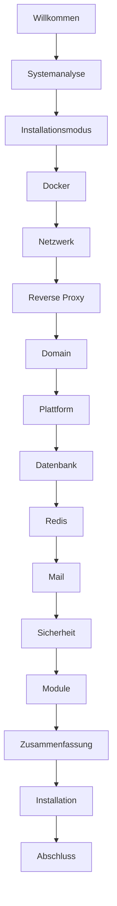

# FestSchmiede – Installationsanleitung

> **Version 2.3.2** – Professioneller interaktiver Installations-Assistent (TUI)

## Schnellstart

### Online (ohne Git-Clone)

```bash
curl -fsSL https://raw.githubusercontent.com/TimUx/FestSchmiede/v2.3.2/install.sh | bash
```

**Installationspfad angeben** (Priorität: `--dir` > `FESTSCHMIEDE_INSTALL_DIR` > Default):

```bash
# Option 1: Kommandozeilen-Option
./install.sh -d /opt/festschmiede

# Option 2: Umgebungsvariable
FESTSCHMIEDE_INSTALL_DIR=/opt/festschmiede curl -fsSL .../install.sh | bash

# Option 3: Bei Online-Installation Argumente durchreichen
curl -fsSL .../install.sh | bash -s -- -d /opt/festschmiede

# Option 4: Eigenen Standard-Pfad vorgeben
FESTSCHMIEDE_DEFAULT_INSTALL_DIR=/srv/festschmiede curl -fsSL .../install.sh | bash
```

Standard-Installationsverzeichnis (wenn nichts angegeben):

| Benutzer | Pfad |
|----------|------|
| normaler Benutzer | `~/festschmiede` |
| root | `/opt/festschmiede` |

### Nach Git-Clone

```bash
git clone https://github.com/TimUx/FestSchmiede.git
cd FestSchmiede
./install.sh
```

Der Assistent führt Sie Schritt für Schritt durch die komplette Installation.

## Voraussetzungen

| Anforderung | Minimum | Empfohlen |
|-------------|---------|-----------|
| Betriebssystem | Debian 11+, Ubuntu 20.04+ | Debian 12 / Ubuntu 24.04 |
| RAM | 2 GB | 4 GB+ |
| CPU | 2 Kerne | 4 Kerne |
| Festplatte | 10 GB | 20 GB+ |
| Docker | 24+ (wird ggf. installiert) | Docker CE aktuell |
| Docker Compose | v2 | v2 |

Optional: `dialog` oder `gum` für die TUI-Oberfläche (Debian/Ubuntu: `dialog` ist standardmäßig vorhanden).

## Installations-Assistent

### Ablauf



### Schritte im Detail

1. **Systemanalyse** – Distribution, CPU, RAM, Docker, Netzwerke, Ports, Reverse Proxy
2. **Installationsmodus** – Neuinstallation, Upgrade, Migration, Reparatur, Nur Config
3. **Docker** – Erkennung oder automatische Installation
4. **Reverse Proxy** – Keiner (lokale Host-Ports), Traefik, vorhandener Proxy oder NGINX (manuell)
5. **Proxy-Netzwerk** – **Nur wenn ein Reverse Proxy gewählt wurde:** Docker-Netzwerk für den Frontend-Container wählen oder erstellen. Ohne Proxy entfällt dieser Schritt; es wird nur das interne Netz `festschmiede_internal` verwendet.
6. **Domain** – Basisdomain, WWW/APP-Subdomains, HTTPS/Let's Encrypt
7. **Plattform** – Name, Zeitzone, Sprache
8. **Datenbank** – Intern (PostgreSQL-Container) oder extern
9. **Redis** – Intern, extern oder keiner
10. **Mail** – SMTP-Konfiguration (optional, kann später in `/platform/email` erfolgen)
11. **Sicherheit** – Automatisch generierte Secrets (JWT, Encryption, Admin-Passwort, …)
12. **Module** – Payment, Legal, Notifications, …
13. **Zusammenfassung** – Bestätigung vor Installation

### Navigation

- **Weiter** – nächster Schritt
- **Zurück** – vorheriger Schritt
- **Abbrechen** – Installation beenden (jederzeit)

### Reverse Proxy und Netzwerke

| Netzwerk | Wann | Zweck |
|----------|------|--------|
| `festschmiede_internal` | Immer | Backend, Datenbank, Redis und Frontend untereinander (nicht abfragbar) |
| Proxy-Netzwerk (z. B. `traefik` oder `festschmiede_public`) | Nur mit Reverse Proxy | Nur der **Frontend**-Container wird zusätzlich an das Netz angeschlossen, in dem Traefik/NGINX läuft — sonst kann der Proxy die App nicht erreichen |

Ohne Reverse Proxy werden **Host-Ports** freigegeben; der Schritt „Proxy-Netzwerk“ entfällt.

Beim Online-Install (`curl … \| bash`) werden vorhandene Installationen automatisch auf die Version aus dem Bootstrap-Skript aktualisiert. Erzwingen: `FESTSCHMIEDE_FORCE_DOWNLOAD=1`.

## Erzeugte Dateien

| Datei | Beschreibung |
|-------|-------------|
| `.env` | Umgebungsvariablen (chmod 600) |
| `installer/generated/compose.override.yml` | Docker-Compose-Erweiterung |
| `installer/logs/install-*.log` | Installationsprotokoll |
| `.installer-state/` | Wizard-Status und Backups |
| `.installer-state/credentials.txt` | Admin-Zugangsdaten (chmod 600) |

## Installationsmodi

| Modus | Beschreibung |
|-------|-------------|
| Neuinstallation | Komplette Erstinstallation |
| Upgrade | Geführtes Update (Backup → Pull → Health → Rollback) |
| Migration | Wie Upgrade, mit Migrations-Hinweisen |
| Reparatur | Container neu starten + Health |
| Nur Config | `.env` aktualisieren ohne Neuaufbau |

Bei **Upgrade** und **Migration** erstellt der Installer vor dem Container-Start automatisch ein Datenbank-Backup (`backups/`). Das Backend wendet Schema-Änderungen per `prisma migrate deploy` an.

## Geführte Betriebsbefehle (ohne TUI)

Für Updates und Wartung ohne Wizard:

```bash
./install.sh --update      # Backup, Migration, Health, Rollback bei Fehler
./install.sh --validate    # Voraussetzungen prüfen (keine Änderungen)
./install.sh --backup      # Nur Datenbank-Backup
./install.sh --repair      # Neustart + Health
```

Im Installationsverzeichnis ausführen (z. B. `~/festschmiede`). Details: [OPERATIONS.md](./OPERATIONS.md#update-durchführen), [ADR-044](./architecture/044-guided-operations.md).

## Rollback

Bei Fehlern bietet der Installer:

- **Erneut versuchen**
- **Rollback** – vorherige `.env` wiederherstellen
- **Protokoll anzeigen**

Backups unter `.installer-state/backups/`.

## Manuelle Installation (ohne TUI)

```bash
cp .env.example .env
# .env bearbeiten
docker compose pull && docker compose up -d
```

Produktion mit Traefik:

```bash
docker compose -f docker-compose.yml -f docker-compose.prod.yml up -d
```

Siehe auch: [Operations — Backup & Restore](./OPERATIONS.md), [ADR-027](./architecture/027-multi-tenant-deployment.md)

## Docker-Referenz

| Compose-Datei | Zweck |
|---------------|-------|
| `docker-compose.yml` | Standard (lokal, Single-Node) |
| `docker-compose.prod.yml` | Traefik, interne Netzwerke, Healthchecks |
| `docker-compose.ci.yml` | CI/QA |
| `docker-stack.yml` | Docker Swarm |

| Service | Rolle |
|---------|-------|
| postgres | PostgreSQL (alle Mandanten) |
| backend | API + Socket.IO |
| frontend | nginx + SPA |
| traefik | Reverse Proxy (prod overlay) |

Wichtige Umgebungsvariablen: `JWT_SECRET`, `APP_ENCRYPTION_KEY`, `DATABASE_URL`, `PLATFORM_DOMAIN`, `MULTI_TENANT_ENABLED`. Fachliche Einstellungen (SMTP, Zahlung) nur über die Admin-Oberfläche.

## Produktions-Deployment

```
Internet → Traefik (TLS) → Frontend (nginx) → Backend → PostgreSQL
```

**Voraussetzungen:** DNS für `<PLATFORM_DOMAIN>` und `*.<PLATFORM_DOMAIN>`, Ports 80/443, starke Secrets.

```env
ACME_EMAIL=admin@example.test
PLATFORM_DOMAIN=plattform.de
PLATFORM_WILDCARD_DOMAIN=*.plattform.de
MULTI_TENANT_ENABLED=true
JWT_SECRET=<64+ Zeichen>
APP_ENCRYPTION_KEY=<32+ Zeichen>
TRUSTED_PROXY_HOPS=2
```

```bash
docker compose -f docker-compose.yml -f docker-compose.prod.yml up -d
```

Health: `GET /api/health` · Uploads: `uploads/{tenantId}/` · Details: [ADR-027](./architecture/027-multi-tenant-deployment.md)

## Tests

```bash
./installer/tests/run-tests.sh
./installer/tests/operations.test.sh
./installer/tests/restore-dry-run.test.sh
# oder gesamt:
npm run qa:installer
```

## Troubleshooting

| Problem | Lösung |
|---------|--------|
| Docker nicht erreichbar | `sudo systemctl start docker` |
| Port 80/443 belegt | Anderen Dienst stoppen oder Proxy-Modus wählen |
| Backend-Timeout | `docker compose logs backend` prüfen |
| TUI fehlt | `sudo apt install dialog` |

Protokoll: `installer/logs/install-*.log`

## Nach der Installation

1. Plattform-Admin unter `/platform/login` anmelden
2. SMTP unter `/platform/email` konfigurieren (falls nicht im Installer)
3. Mandanten anlegen oder Einrichtungsassistent durchlaufen
4. Backup einrichten: `scripts/backup/postgres-backup.sh`
