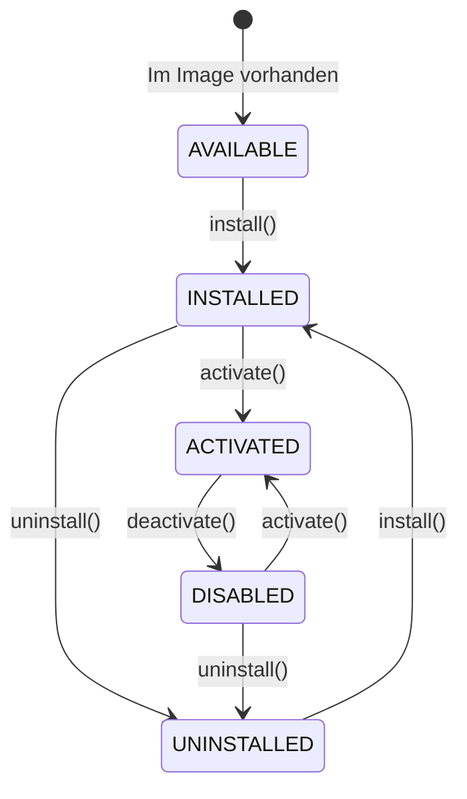

# Modul-Architektur – Entwicklerdokumentation

Technische Dokumentation für das Feature-Modulsystem und die Modulverwaltung der Vereinsbestellplattform.

## Inhaltsverzeichnis

1. [Architekturprinzip](#architekturprinzip)
2. [Docker & Modulauslieferung](#docker--modulauslieferung)
3. [Verzeichnisstruktur](#verzeichnisstruktur)
4. [Modulstatus](#modulstatus)
5. [Modul-Lifecycle](#modul-lifecycle)
6. [module.json Manifest](#modulejson-manifest)
7. [Datenbank](#datenbank)
8. [ModuleManager](#modulemanager)
9. [Abhängigkeiten](#abhängigkeiten)
10. [Docker-Updates & Versionierung](#docker-updates--versionierung)
11. [Admin-Oberfläche](#admin-oberfläche)
12. [Hook-System](#hook-system)
13. [API-Endpunkte](#api-endpunkte)
14. [Neues Modul erstellen](#neues-modul-erstellen)
15. [Migrationen](#migrationen)
16. [Community-Plugins (Zukunft)](#community-plugins-zukunft)
17. [Best Practices](#best-practices)
18. [Payment-Modul](#payment-modul)
19. [Legal-Modul](#legal-modul)

---

## Architekturprinzip

```
Core kennt keine Plugins.
Plugins kennen den Core.
```

Der **Core** enthält ausschließlich Grundfunktionen. **Module** erweitern die Plattform über Extension Points (Hooks, Routes, Permissions, Menüs, Widgets).

---

## Docker & Modulauslieferung

Alle offiziellen Module werden **mit dem Docker-Image ausgeliefert**.

| Eigenschaft | Verhalten |
|-------------|-----------|
| Download | Keine – Module sind im Image enthalten |
| Dateikopie bei Installation | Keine – nur DB-Initialisierung |
| Update | Automatisch mit neuem Docker-Image |
| Pfad im Container | `/app/modules` (ENV: `MODULES_DIR`) |
| Community-Plugins (Zukunft) | `/app/plugins` (ENV: `PLUGINS_DIR`) |

Bei jedem Image-Upgrade erhält jeder Verein die neuesten Modulversionen. Der `ModuleManager` erkennt höhere Versionen und führt `upgrade()` aus.

---

## Verzeichnisstruktur

```
food-order/
├── backend/
│   ├── modules/              # Offizielle Module (→ /app/modules im Container)
│   │   ├── payment/          # Online-Zahlung (vollständig)
│   │   ├── legal/            # Rechtliche Informationen (vollständig)
│   │   ├── inventory/        # Lagerverwaltung (Stub)
│   │   ├── printer/          # Bondruck (Stub)
│   │   ├── voucher/          # Gutscheine (Stub, benötigt payment)
│   │   ├── discount/         # Rabatte (Stub)
│   │   ├── notifications/    # Benachrichtigungen (Stub)
│   │   ├── analytics/        # Auswertungen (Stub)
│   │   ├── loyalty/          # Treueprogramm (Stub)
│   │   ├── checkin/          # QR-Einlass (Stub)
│   │   └── cash-register/    # Kassenanbindung (Stub)
│   ├── plugins/              # Reserviert für Community-Plugins
│   └── src/
│       ├── module-system/    # Framework
│       │   ├── ModuleDiscovery.ts
│       │   ├── ModuleLoader.ts
│       │   ├── ModuleManager.ts
│       │   ├── ModuleRegistry.ts
│       │   ├── DependencyResolver.ts
│       │   └── ...
│       └── core/
└── plugins/                  # Repo-Root (Dokumentation/Zukunft)
```

---

## Modulstatus



| Status | Bedeutung |
|--------|-----------|
| **AVAILABLE** | Modul im Docker-Image, nicht initialisiert |
| **INSTALLED** | Migrationen & Default-Config angelegt, nicht aktiv |
| **ACTIVATED** | Hooks, Routes, Menüs, Widgets registriert |
| **DISABLED** | Installiert, aber keine Erweiterungen aktiv |
| **UNINSTALLED** | Initialisierung entfernt, Code bleibt im Image |

Nur **ACTIVATED** Module registrieren Ressourcen. Nicht aktivierte Module verbrauchen keine Hooks, Routes oder Menüs.

---

## Modul-Lifecycle

### Installieren (`install()`)

- Migrationen ausführen
- Default-Config anlegen
- Permissions registrieren (Metadaten)
- Standarddaten einrichten
- **Keine Dateikopie**

### Aktivieren (`activate()`)

1. Abhängigkeiten prüfen
2. Migrationen/Upgrade prüfen
3. `initialize()` + `enable()`
4. Services, Routes, Hooks, Widgets, Menüs registrieren
5. Health Check
6. Status `ACTIVATED`

### Deaktivieren (`deactivate()`)

- `disable()` + `shutdown()`
- Hooks entfernen, Menüs/Widgets deregistrieren
- Routes via Guard gesperrt
- Daten bleiben erhalten, Modul bleibt installiert

### Neu initialisieren (`reinitialize()`)

Deaktivieren → Deinstallieren → Installieren → optional Reaktivieren

### Upgrade (`upgrade()`)

Automatisch beim Start, wenn Image-Version > DB-Version.

---

## module.json Manifest

Jedes Modul in `/modules/{id}/module.json`:

```json
{
  "id": "payment",
  "name": "Online-Zahlung",
  "description": "Online-Zahlungen über verschiedene Anbieter",
  "version": "1.0.0",
  "author": "Vereinsbestellung",
  "homepage": "https://github.com/TimUx/food-order",
  "license": "MIT",
  "entry": "index",
  "dependencies": {
    "required": [],
    "optional": []
  },
  "permissions": [
    { "key": "payment.settings", "description": "Zahlungseinstellungen verwalten" }
  ],
  "minimumCoreVersion": "1.0.0"
}
```

`ModuleDiscovery` scannt beim Start alle Verzeichnisse in `MODULES_DIR`.

---

## Datenbank

Tabelle `modules`:

| Spalte | Typ | Beschreibung |
|--------|-----|--------------|
| `module_id` | PK | Modul-ID aus Manifest |
| `module_version` | String | Installierte Version |
| `installed` | Boolean | Initialisierung abgeschlossen |
| `enabled` | Boolean | Modul aktiviert |
| `installed_at` | DateTime | Installationszeitpunkt |
| `updated_at` | DateTime | Letzte Änderung |
| `config_json` | JSON | Modul-Konfiguration (kann verschlüsselte Werte enthalten) |
| `last_health_status` | String | Letzter Health-Status |
| `last_health_check` | DateTime | Zeitpunkt des letzten Checks |
| `ever_installed` | Boolean | War jemals installiert |
| `ever_activated` | Boolean | War jemals aktiviert |

```bash
cd backend && npx prisma db push
```

---

## ModuleManager

```mermaid
flowchart TD
    Start[App-Start] --> Discover[/modules scannen]
    Discover --> Manifest[module.json lesen]
    Manifest --> Load[Modul laden]
    Load --> DB[(DB prüfen)]
    DB --> Upgrade{Neue Version?}
    Upgrade -->|Ja| RunUpgrade[upgrade()]
    Upgrade -->|Nein| CheckEnabled{enabled?}
    RunUpgrade --> CheckEnabled
    CheckEnabled -->|Ja| Activate[Ressourcen registrieren]
    CheckEnabled -->|Nein| Skip[Keine Ressourcen]
    Activate --> Ready[Bereit]
    Skip --> Ready
```

---

## Abhängigkeiten

```json
"dependencies": {
  "required": ["payment"],
  "optional": ["inventory"]
}
```

- **required**: Muss installiert **und aktiviert** sein
- **optional**: Nur dokumentarisch, keine Erzwingung

Beispiel: `voucher` benötigt `payment`. Aktivierung schlägt fehl, wenn Payment nicht aktiviert ist.

Der `DependencyResolver` verhindert auch Deaktivierung, wenn andere Module abhängen.

---

## Docker-Updates & Versionierung

1. Neues Docker-Image mit aktualisierten `/modules`-Dateien deployen
2. `ModuleManager.checkUpgrades()` vergleicht Manifest-Version mit `module_version` in DB
3. Bei höherer Version: `mod.upgrade(context, oldVersion, newVersion)`
4. Modul-eigene Migrationen werden ausgeführt
5. `module_version` in DB aktualisiert

Semver-Vergleich via `compareVersions()`.

---

## Admin-Oberfläche

**Administration → Module** (`/admin/module`)

| Spalte | Inhalt |
|--------|--------|
| Name / Beschreibung | Aus Manifest |
| Version | Image-Version |
| Status | AVAILABLE / INSTALLED / ACTIVATED / DISABLED / UNINSTALLED |
| Installiert | Ja/Nein |
| Aktiviert | Ja/Nein |
| Health | healthy / degraded / unhealthy |
| Abhängigkeiten | required (*) und optional (?) |

### Aktionen

| Aktion | API |
|--------|-----|
| Installieren | `POST /api/admin/modules/:id/install` |
| Aktivieren | `POST /api/admin/modules/:id/activate` |
| Deaktivieren | `POST /api/admin/modules/:id/deactivate` |
| Deinstallieren | `POST /api/admin/modules/:id/uninstall` |
| Neu initialisieren | `POST /api/admin/modules/:id/reinitialize` |
| Konfigurieren | `PUT /api/admin/modules/:id/config` |
| Health Check | `GET /api/admin/modules/:id/health` |

---

## Hook-System

| Hook | Auslöser |
|------|----------|
| `onOrderCreated` | Neue Bestellung |
| `onOrderPaid` | Zahlung bestätigt |
| `onOrderCancelled` | Stornierung |
| `onKitchenCompleted` | Status READY |
| `onUserLogin` | Mitarbeiter-Login |
| `onEventCreated` | Neue Veranstaltung |
| `onSettingsChanged` | Einstellungen geändert |

Nur **aktivierte** Module empfangen Hooks.

---

## API-Endpunkte

| Methode | Pfad | Beschreibung |
|---------|------|--------------|
| GET | `/api/admin/modules` | Alle Module |
| POST | `/api/admin/modules/:id/install` | Installieren |
| POST | `/api/admin/modules/:id/activate` | Aktivieren |
| POST | `/api/admin/modules/:id/deactivate` | Deaktivieren |
| POST | `/api/admin/modules/:id/uninstall` | Deinstallieren |
| POST | `/api/admin/modules/:id/reinitialize` | Neu initialisieren |
| GET/PUT | `/api/admin/modules/:id/config` | Konfiguration |
| GET | `/api/admin/modules/:id/health` | Health Check |
| GET | `/api/public/modules/menu` | Menüeinträge aktiver Module |

Modul-API (nur wenn aktiviert): `/api/modules/features/{moduleId}/...`

---

## Neues Modul erstellen

1. Verzeichnis `backend/modules/my-module/` anlegen
2. `module.json` schreiben
3. `index.ts` mit Module-Instanz exportieren
4. `Module`-Interface implementieren
5. Beim nächsten Docker-Build automatisch im Image

Kein Core-Code muss geändert werden – Discovery findet das Modul automatisch.

---

## Migrationen

Jedes Modul verwaltet eigene Migrationen in `modules/{id}/migrations/`.

- Werden in `install()` und `upgrade()` ausgeführt
- Core-Migrationen dürfen **nicht** von Modul-Tabellen abhängen
- Modul-Tabellen dürfen nur vom Modul selbst verwaltet werden

---

## Community-Plugins (Zukunft)

Verzeichnis `/plugins` ist vorbereitet, wird im aktuellen Stand **nicht** geladen.

```typescript
// ModuleDiscovery.scanDirectory(config.pluginsDir, 'community')
// Aktuell: nur config.modulesDir wird aktiv gescannt
```

Externe Entwickler können später Plugins nach gleichem Manifest-Schema bereitstellen.

---

## Best Practices

- Module niemals aus dem Internet laden – nur aus `/modules` im Image
- Config mit Zod validieren (`getConfigContract()`)
- `upgrade()` idempotent implementieren
- Abhängigkeiten in `module.json` deklarieren
- Health Checks für Admin-Transparenz
- Keine direkten Core-Änderungen – nur Extension Points
- Permission-Keys: `{moduleId}.{action}`

---

## Payment-Modul

Das erste offizielle Modul (`backend/modules/payment/`) integriert Online-Zahlungen über den bestehenden `ModuleManager`. Der Core kennt keine Provider – er fragt nur den `paymentServiceRegistry`-Extension-Point.

### Architektur

```
Order-Modul (Core)                    Payment-Modul
       │                                    │
       ├─ registriert PayableResource ─────►│ Provider-Abstraktion
       │   (type: order)                     │ (Stripe, PayPal, …)
       │                                    │
       └─ paymentServiceRegistry.isAvailable()
          paymentServiceRegistry.createCheckout()
```

### PayableResource

Zahlbare Ressourcen sind vom Payment-Modul unabhängig vom Domänenmodell:

```typescript
interface PayableResource {
  type: string;           // z. B. 'order', 'ticket', 'donation'
  id: string;
  amountCents: number;
  currency: string;
  description: string;
  customerEmail?: string;
  returnUrl: string;
  cancelUrl: string;
  metadata?: Record<string, string>;
}
```

**Adapter registrieren** (im Core oder einem anderen Modul):

```typescript
import { payableResourceRegistry } from '../module-system/extension-points';

payableResourceRegistry.register({
  type: 'order',
  async toPayableResource(id, baseUrl) { /* … */ },
  async onPaymentCompleted(id) { /* Küche benachrichtigen */ },
  async onPaymentFailed(id) { /* optional */ },
});
```

Das Payment-Modul ruft nach erfolgreicher Zahlung `onPaymentCompleted()` auf – ohne zu wissen, dass es eine Bestellung ist.

### Standardverhalten (Modul deaktiviert / nicht installiert / kein Provider)

- Keine Checkout-URLs, keine Zahlungs-Buttons
- Bestellungen gehen direkt an die Küche
- Zahlung nur an der Kasse
- Keine zusätzlichen Admin-Menüs (außer Modulverwaltung)

### Provider

| Provider | Status | Konfigurationsschlüssel |
|----------|--------|-------------------------|
| Stripe | Vollständig | `stripe` |
| PayPal | Platzhalter | `paypal` |
| VR Payment | Platzhalter | `vrPayment` |
| S-Payment | Platzhalter | `sPayment` |
| PAYONE | Platzhalter | `payone` |
| SumUp | Platzhalter | `sumup` |

Neuen Provider hinzufügen:

1. Klasse in `modules/payment/providers/` implementieren (`PaymentProvider`-Interface)
2. In `PaymentFactory.registerAll()` registrieren
3. Zod-Schema in `config.ts` erweitern
4. Admin-UI: Settings-Schema in `module.json` und optional `PaymentAdminPage` / Settings-Tab ergänzen

### Stripe (vollständig)

| Funktion | Implementierung |
|----------|-----------------|
| Checkout | Stripe Checkout Sessions |
| Webhook | `POST /api/modules/features/payment/webhooks/stripe` |
| Refund | Admin-API `POST .../admin/refunds` |
| Status | `payment_sessions` / `payment_transactions` |
| Sandbox | `stripe.sandbox` in Modul-Config |
| Health Check | `stripe.balance.retrieve()` |

Webhook-Signatur wird mit `stripe.webhooks.constructEvent()` geprüft. API-Keys werden über den **SettingsService** AES-256-GCM-verschlüsselt gespeichert (`APP_ENCRYPTION_KEY`).

### Bestellablauf mit aktivem Payment

1. `orderService.createOnlineOrder()` prüft `paymentServiceRegistry.isAvailable()`
2. Falls ja: Bestellung wird erstellt, Küchen-Benachrichtigung **ausgesetzt**
3. `payableResourceRegistry.toPayableResource('order', id)` liefert die Ressource
4. `paymentServiceRegistry.createCheckout(resource)` → Redirect zur Provider-Checkout-Seite
5. Webhook bestätigt Zahlung → `onPaymentCompleted()` → Küche + E-Mail
6. Küchen-Ansicht filtert unbezahlte Online-Bestellungen via `filterReleasedIds()`

### Datenbank (nur Payment-Modul)

Tabellen in `modules/payment/migrations/`:

- `payment_sessions` – Checkout-Sitzungen pro Ressource
- `payment_transactions` – Zahlungen und Rückerstattungen

### Admin

Nach Aktivierung: **Administration → Module → Payment** (`/admin/payment`)

Tabs: Übersicht, Provider, Zahlungsarten, Einstellungen, Zahlungen, Refunds, Logs, Webhooks, Health, Statistiken.

API (nur wenn Modul aktiviert):

| Methode | Pfad | Beschreibung |
|---------|------|--------------|
| GET | `/api/modules/features/payment/status` | Zahlung verfügbar? |
| GET | `/api/modules/features/payment/providers` | Provider-Liste |
| POST | `/api/modules/features/payment/webhooks/:providerId` | Webhook-Eingang |
| GET | `/api/modules/features/payment/admin/dashboard` | Dashboard |
| GET/PUT | `/api/admin/settings/module.payment` | Provider-Konfiguration (SettingsService) |
| POST | `/api/modules/features/payment/admin/providers/:id/test` | Verbindungstest |
| POST | `/api/modules/features/payment/admin/refunds` | Rückerstattung |

Öffentlicher Core-Endpunkt (ohne Modul-Wissen): `GET /api/public/payment/status`

### Sicherheit (Payment)

- API-Keys verschlüsselt (SettingsService, ENV: `APP_ENCRYPTION_KEY`)
- Webhook-Signaturen werden geprüft
- Keine Secrets in Logs
- Routes nur über `ModuleManager` mit Aktivierungs-Guard

---

## Legal-Modul

Das Modul `backend/modules/legal/` verwaltet veröffentlichbare Rechtstexte wie Impressum, Datenschutzerklärung, AGB und Widerrufsbelehrung. Der Core kennt keine einzelnen Rechtsseiten, sondern nutzt ausschließlich den Extension Point `legalContentRegistry`.

### Architektur

```text
PublicLayout / Notification-Modul / Core-Routen
                 │
                 ▼
         legalContentRegistry
                 │
                 ▼
           Legal-Modul
       (DB + Sanitizing + Slugs)
```

### Datenmodell

Seiten werden in `legal_pages` gespeichert:

- `page_type`
- `title`
- `slug`
- `enabled`
- `published`
- `content_html`
- `updated_at`

Modulweite Optionen liegen in `module.legal`:

- `appendClubContactToImprint`
- `showFooterLinks`
- `showNotificationLinks`

### Öffentliche Sichtbarkeit

Eine Rechtsseite erscheint nur, wenn:

1. das Modul aktiviert ist,
2. die Seite aktiviert ist,
3. die Seite veröffentlicht ist,
4. Inhalt vorhanden ist.

### Öffentliche API

| Methode | Pfad | Beschreibung |
|---------|------|--------------|
| GET | `/api/public/legal-links` | Veröffentlichte Footer-/E-Mail-Links |
| GET | `/api/public/legal/:slug` | Veröffentlichte Rechtsseite |
| GET | `/api/modules/features/legal/admin/pages` | Seitenliste für Admin |
| PUT | `/api/modules/features/legal/admin/pages/:pageType` | Seite speichern |
| POST | `/api/modules/features/legal/admin/preview` | Sanitizte Vorschau |

### Notification-Anbindung

Wenn das Legal-Modul aktiv ist, ergänzt das Notifications-Modul E-Mails automatisch um veröffentlichte Rechtslinks. Ohne aktiviertes Legal-Modul erscheinen keine zusätzlichen Footer-Links.

---

## Sicherheit

- Ein Modul registriert ausschließlich eigene Ressourcen
- Module dürfen Core-Komponenten nicht direkt verändern
- Route-Guard verhindert Zugriff auf deaktivierte Module
- Config kann sensible Werte enthalten – Verschlüsselung auf Anwendungsebene vorbereitet
