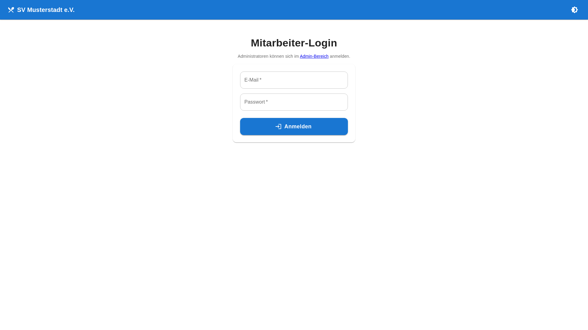
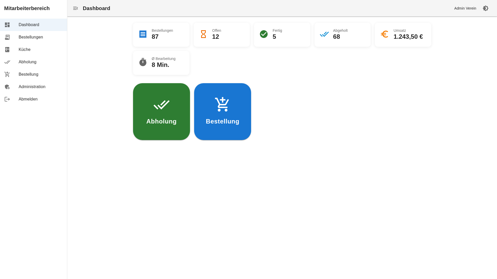
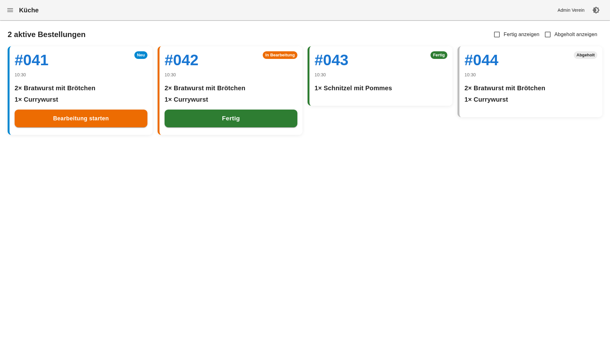
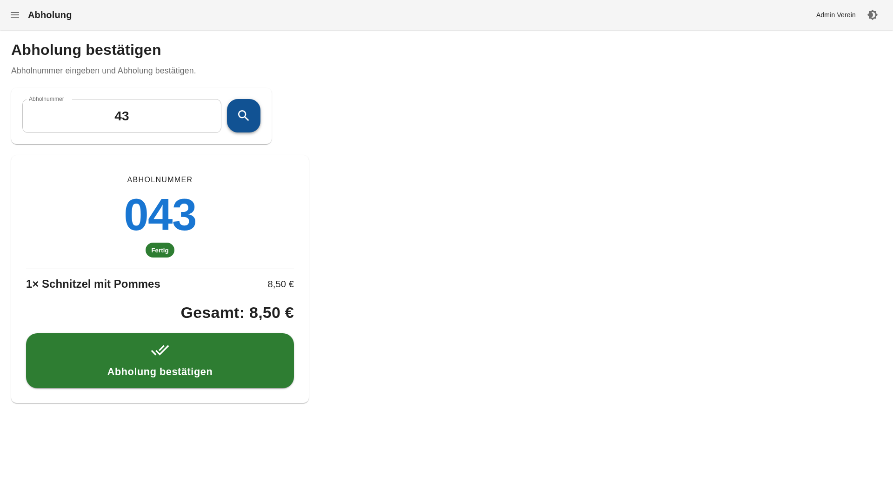
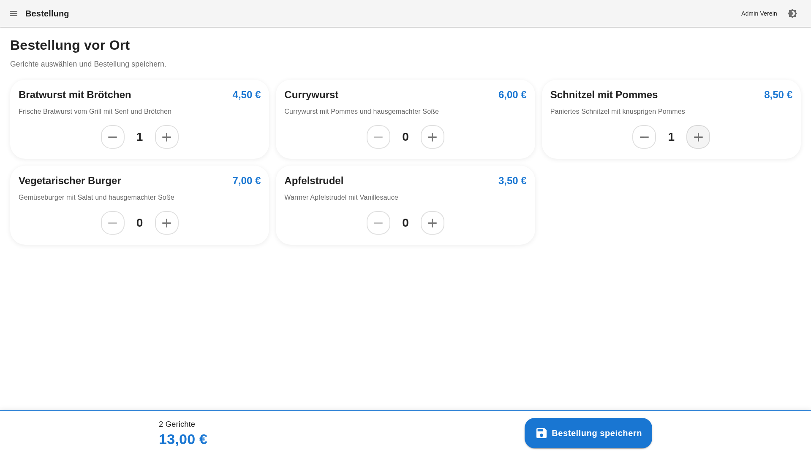
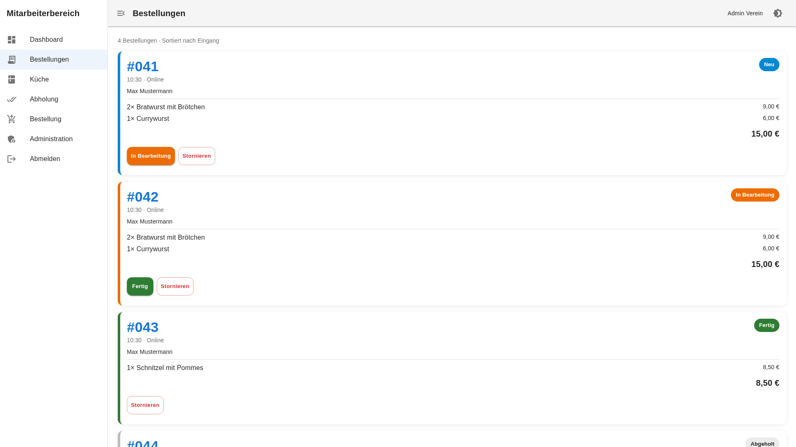
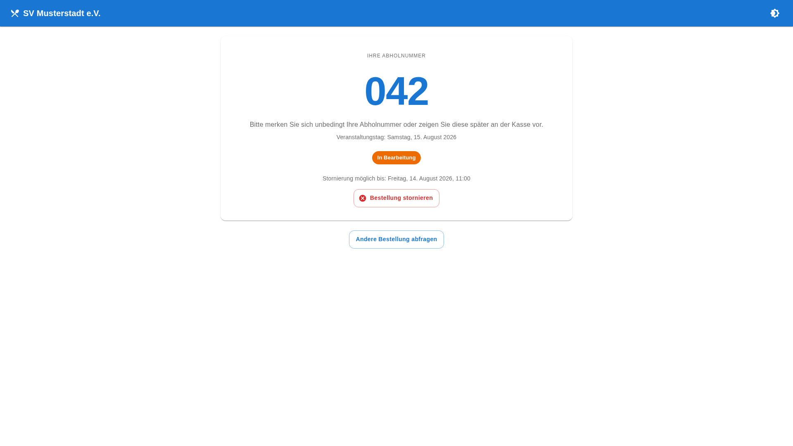
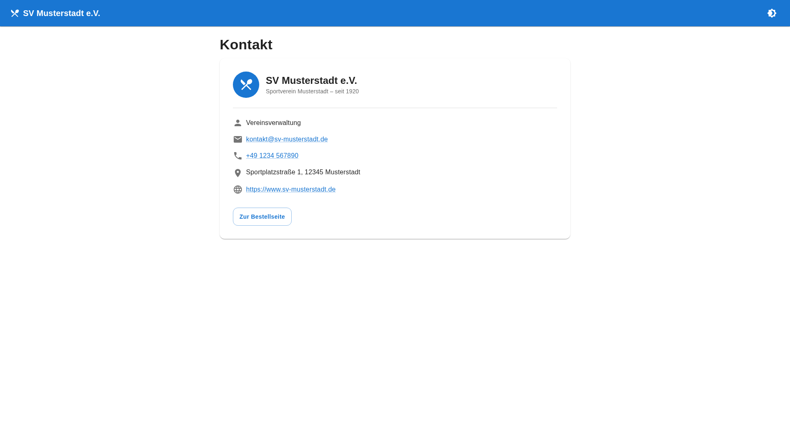
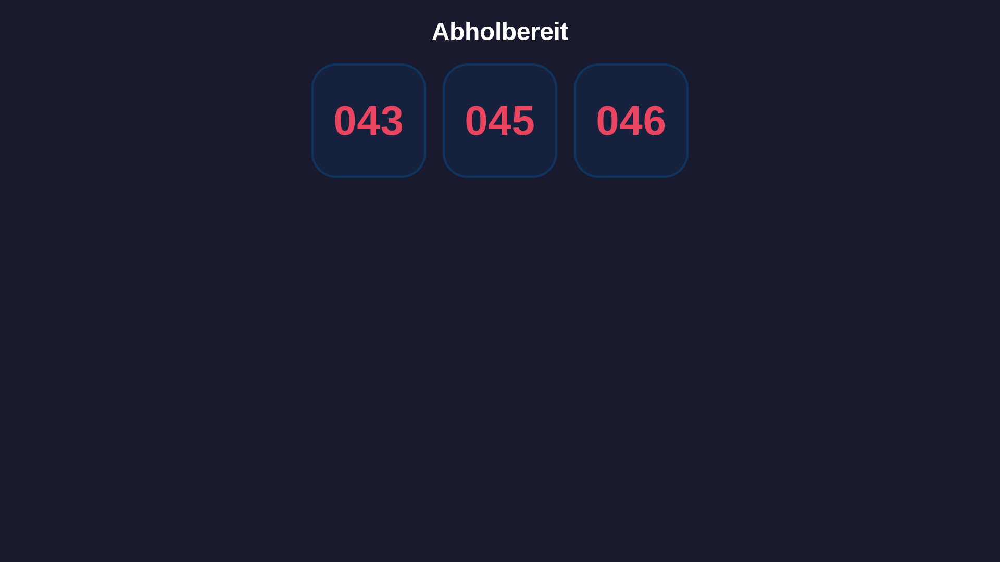

# Benutzerhandbuch (Mitarbeiter)

Anleitung für Mitarbeiter in Küche, Abholung und Service – ohne Administratorrechte.

## Inhaltsverzeichnis

1. [Anmeldung](#anmeldung)
2. [Übersicht der Bereiche](#übersicht-der-bereiche)
3. [Küchenansicht](#küchenansicht)
4. [Abholung](#abholung)
5. [Bestellung vor Ort](#bestellung-vor-ort)
6. [Bestellungen verwalten](#bestellungen-verwalten)
7. [Vorausbestellungen am Event-Tag](#vorausbestellungen-am-event-tag)
8. [Tipps & häufige Fragen](#tipps--häufige-fragen)

---

## Anmeldung

1. Öffnen Sie die Adresse Ihres Vereins, z. B. `https://bestellung.ihr-verein.de/mitarbeiter/login`
2. Geben Sie E-Mail und Passwort ein
3. Tippen Sie auf **Anmelden**



**Test-Zugangsdaten (Demo):**

| Rolle | E-Mail | Passwort | Login |
|-------|--------|----------|-------|
| Küche / Service | kueche@verein.local | staff123 | `/mitarbeiter/login` |

> **Hinweis für Administratoren:** Vereinsdaten, Benutzer und Veranstaltungen verwalten Sie im separaten [Administrationsbereich](/admin/login) – siehe [Admin Guide](ADMIN_GUIDE.md).

> Die App kann als PWA auf dem Tablet installiert werden (Zum Startbildschirm hinzufügen).

### Menü ein- und ausblenden

In Küche, Abholung und Bestellung ist das Seitenmenü standardmäßig **ausgeblendet** – für maximale Arbeitsfläche. Über das Menü-Symbol oben links können Sie es jederzeit ein- oder ausblenden.

---

## Übersicht der Bereiche

Nach der Anmeldung sehen Sie das **Dashboard** mit aktuellen Zahlen:



| Menüpunkt | Für wen | Aufgabe |
|-----------|---------|---------|
| Dashboard | Alle | Übersicht, Statistiken, Schnellzugriff Abholung/Bestellung |
| Bestellungen | Alle | Alle Bestellungen einsehen |
| Küche | Küchenteam | Bestellungen bearbeiten |
| Abholung | Ausgabe | Abholung per Nummer bestätigen |
| Bestellung | Vor Ort | Neue Bestellung aufgeben |
| Administration | Nur Admin | Link zum Admin-Bereich (Verein, Benutzer, Events) |

---

## Küchenansicht

**Adresse:** `/mitarbeiter/kueche`

Optimiert für Tablets mit großen Buttons.



### Ablauf

1. Neue Bestellungen erscheinen automatisch mit Status **Neu**
2. Tippen Sie **Bearbeitung starten** → Status wird *In Bearbeitung*
3. Wenn das Essen fertig ist: **Fertig** tippen → Status wird *Fertig*
4. Die Abholnummer erscheint auf dem öffentlichen Abholboard

### Filter

Standardmäßig werden nur **Neu** und **In Bearbeitung** angezeigt.

Optional einschaltbar:
- ☑ Fertig anzeigen
- ☑ Abgeholt anzeigen

---

## Abholung

**Adresse:** `/mitarbeiter/abholung`

Hier bestätigen Sie, dass ein Kunde seine Bestellung abgeholt hat.



### Ablauf

1. Kunde nennt seine **Abholnummer** (z. B. „043")
2. Nummer eingeben und suchen
3. Bestellung wird angezeigt: Gerichte, Gesamtpreis, Status
4. Wenn Status **Fertig**: **Abholung bestätigen** tippen
5. Status wechselt zu *Abgeholt*, Nummer verschwindet vom Abholboard

### Hinweise

| Status | Was tun? |
|--------|----------|
| Fertig | Abholung bestätigen |
| In Bearbeitung | Kunde bitten zu warten |
| Abgeholt | Bereits ausgegeben |
| Neu | Noch nicht in der Küche |

---

## Bestellung vor Ort

**Adresse:** `/mitarbeiter/bestellung`

Für Bestellungen **vor Ort** ohne Kundendaten (kein Name nötig).



### Ablauf

1. Gerichte per Plus/Minus auswählen
2. **Bestellung speichern** tippen
3. Die **Abholnummer** wird groß angezeigt
4. Nummer dem Kunden mitteilen oder anzeigen
5. **Nächste Bestellung** für den folgenden Kunden

---

## Bestellungen verwalten

**Adresse:** `/mitarbeiter/bestellungen`



Zeigt alle Bestellungen mit Abholnummer, Uhrzeit, Gerichten, Quelle (Online / Vor Ort) und Status.

### Status per Klick ändern

| Button | Neuer Status |
|--------|-------------|
| In Bearbeitung | Küche hat begonnen |
| Fertig | Bereit zur Abholung |
| Stornieren | Bestellung storniert |

---

## Vorausbestellungen am Event-Tag

Kunden können **Wochen vorher** online bestellen. Am Veranstaltungstag:

1. Alle Vorbestellungen erscheinen in der Küchenansicht
2. Die Abholnummer wurde bereits bei der Bestellung vergeben
3. Kunden können ihren Status unter `/status` verfolgen
4. Bei Abfrage mit **Abholnummer + Nachname** finden Kunden ihre Bestellung wieder
5. Innerhalb der Stornierungsfrist können Kunden auf der Statusseite selbst stornieren (Nachname zur Bestätigung)



Die Statusseite zeigt bei stornierbaren Bestellungen einen **Stornieren**-Button und die Stornierungsfrist an.

---

## Tipps & häufige Fragen

### Kunde möchte Bestellung stornieren?

- Kunden können auf der Statusseite (`/status` oder Link aus der Bestätigungs-E-Mail) innerhalb der Stornierungsfrist selbst stornieren
- Dazu Nachname zur Bestätigung eingeben
- Nach Ablauf der Frist oder bei Status **Fertig** / **Abgeholt**: Stornierung nur noch durch Mitarbeiter in der Bestellübersicht

### Kunde hat Abholnummer vergessen?

- Kunde kann unter `/status` mit **Abholnummer + Nachname** nachschauen
- Oder in der Bestellübersicht nach dem Namen suchen

### Kontaktdaten für Kunden

Kunden finden Vereinskontaktdaten über den **Kontakt**-Button auf der Bestellseite oder unter `/kontakt`.



### Abholboard für Gäste

Separater Monitor unter `/abholboard` – kein Login nötig.



---

## Kurzreferenz Statusablauf

```
Neu  →  In Bearbeitung  →  Fertig  →  Abgeholt
                              ↓
                         Storniert
```

Weitere Informationen für Administratoren: [Admin Guide](ADMIN_GUIDE.md)
