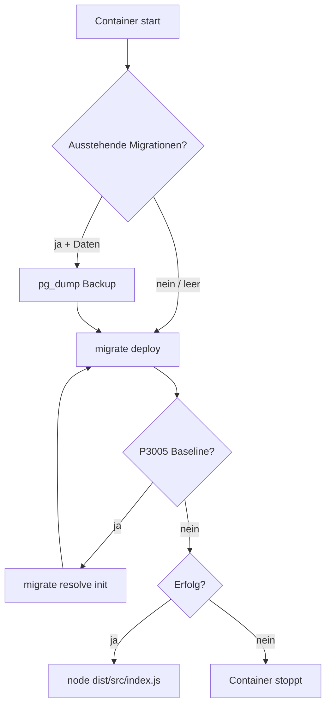

# ADR 039: Produktionsmigrationen

## Status

Accepted (v2.2.2)

## Kontext

Bisher synchronisierte das Backend beim Docker-Start das Schema per `prisma db push`. Das ist für Entwicklung praktisch, aber in Produktion riskant:

- Keine versionierten, reviewbaren Schema-Änderungen
- Kein kontrollierter Upgrade-Pfad
- Kein dokumentierter Rollback bei fehlgeschlagenen Schema-Updates
- Backup vor Schema-Änderungen war nicht erzwungen

## Entscheidung

1. **Prisma Migrate** für das Core-Schema unter `backend/prisma/migrations/`
2. **Produktionsstart** über `backend/scripts/docker-entrypoint.sh`:
   - Pre-Migration-Backup per `pg_dump` (wenn Anwendungsdaten vorhanden)
   - `prisma migrate deploy` (kein `db push`)
   - Baseline für bestehende `db-push`-Installationen via `migrate resolve`
   - App-Start erst nach erfolgreicher Migration
3. **Installer** erstellt vor Upgrade/Migration/Reparatur ein Host-Backup via `scripts/backup/postgres-backup.sh`
4. **`db push`** bleibt nur für lokale Entwicklung (`prisma:push`)

## Ablauf

## Rollback

| Szenario | Maßnahme |
|----------|----------|
| Migration schlägt fehl | Container startet nicht; DB unverändert nach fehlgeschlagener Transaktion |
| Migration fehlerhaft angewendet | `postgres-restore.sh` mit Pre-Migration-Backup |
| Bestehende db-push-DB | Automatisches Baseline auf Init-Migration, danach normale deploys |

## Konsequenzen

- Kontrollierter Release-Prozess für Schema-Änderungen
- Backup vor Migration in Produktion und Installer-Upgrades
- CI testet frische DB und Upgrade von `db push`
- Entwickler nutzen `npm run prisma:migrate` (migrate dev) für neue Migrationen

## Referenzen

- `backend/Dockerfile`, `backend/scripts/docker-entrypoint.sh`
- `scripts/qa/test-migrations.sh`
- `docs/OPERATIONS.md`
