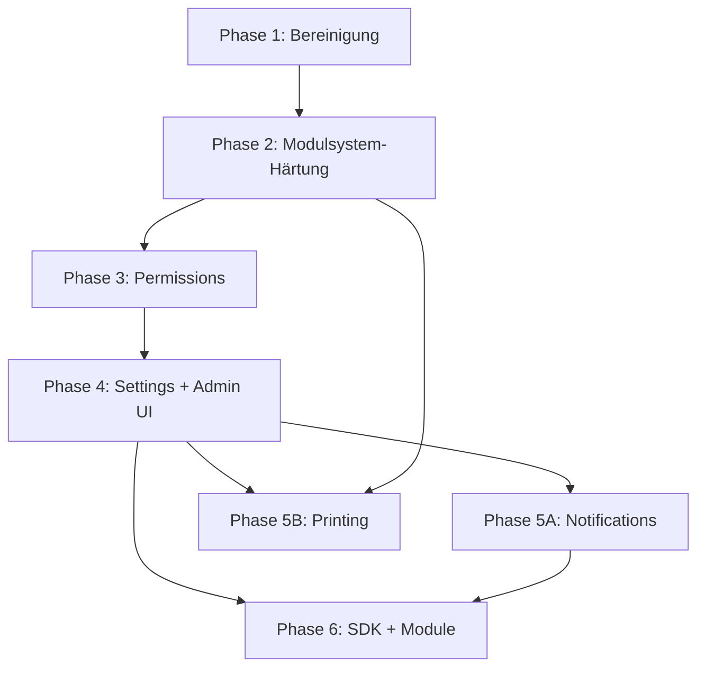

# Migrationsplan – Zielarchitektur

Vollständiger Phasenplan zur Umsetzung der in den ADRs beschriebenen Zielarchitektur.

> **Hinweis:** Dieses Dokument beschreibt ausschließlich geplante Arbeiten. Es wurden **keine Implementierungen** im Rahmen von PROMPT 0 vorgenommen.

---

## Ausgangslage

| Aspekt | Stand v1.2.0 |
|--------|--------------|
| Modulsystem | Implementiert, 1 volles Modul (Payment) |
| Settings | Fragmentiert (Core DB + Modul JSON + .env) |
| Permissions | Deklariert, nicht erzwungen |
| Admin UI | Core-Seiten + hardcodiertes Payment |
| Notifications | Im Core (`emailService`) |
| Printing | Nicht implementiert (Stub) |
| Developer SDK | Nicht vorhanden (relative Imports) |
| Legacy Code | `backend/src/features/` aktiv im Repo |

---

## Zielbild

```
┌─────────────────────────────────────────────────────────────┐
│ Phase 6: Developer SDK + Community Plugins                  │
├─────────────────────────────────────────────────────────────┤
│ Phase 5: Notifications + Printing Module                    │
├─────────────────────────────────────────────────────────────┤
│ Phase 4: Settings Platform + generische Admin-UI            │
├─────────────────────────────────────────────────────────────┤
│ Phase 3: Permission System                                  │
├─────────────────────────────────────────────────────────────┤
│ Phase 2: Modulsystem-Härtung + Qualität                     │
├─────────────────────────────────────────────────────────────┤
│ Phase 1: Bereinigung + Infrastruktur (Quick Wins)           │
└─────────────────────────────────────────────────────────────┘
```

---

## Phase 1: Bereinigung & Infrastruktur

**Ziel:** Technische Schuld reduzieren, Deployment-Lücken schließen, ohne Verhalten zu ändern.

| # | Maßnahme | ADR | Aufwand | Risiko |
|---|----------|-----|---------|--------|
| 1.1 | `backend/src/features/` entfernen | 002, 003 | S | Niedrig |
| 1.2 | `.env.example` vervollständigen (`DATABASE_URL`, `UPLOADS_DIR`, `MODULES_DIST_DIR`) | 004 | S | Niedrig |
| 1.3 | `APP_ENCRYPTION_KEY` in `docker-compose.yml` | 004 | S | Niedrig |
| 1.4 | `package.json`-Versionen auf 1.2.0 angleichen | 001 | S | Niedrig |
| 1.5 | PWA-Icons in `frontend/public/` ergänzen | 006 | S | Niedrig |
| 1.6 | Placeholder-Provider in Admin als „nicht verfügbar“ markieren | 007 | S | Niedrig |
| 1.7 | `VITE_TURNSTILE_SITE_KEY` in `vite-env.d.ts` | 006 | S | Niedrig |

**Erfolgskriterien:** Sauberer Build, keine toten Code-Pfade, vollständige Env-Doku.

**Geschätzte Dauer:** 1–2 Tage

---

## Phase 2: Modulsystem-Härtung & Qualität

**Ziel:** Modulsystem produktionssicher machen, Test- und CI-Abdeckung erhöhen.

| # | Maßnahme | ADR | Aufwand | Risiko |
|---|----------|-----|---------|--------|
| 2.1 | Express-Route-Unmount bei `deactivateModule()` | 003 | M | Mittel |
| 2.2 | `DependencyResolver.checkRequired()` vervollständigen | 003 | S | Niedrig |
| 2.3 | `filterReleasedIds` Batch-Query statt N+1 | 007 | M | Niedrig |
| 2.4 | API-Integrationstests (health, orders, modules) mit supertest | 002 | M | Niedrig |
| 2.5 | Payment-Modul Unit-Tests (SettingsService, config merge) | 007 | M | Niedrig |
| 2.6 | GitHub Actions: `npm test` vor Docker-Build | 001 | M | Niedrig |
| 2.7 | Prisma Migrate evaluieren (statt `db push` in Prod) | 001 | L | Hoch |
| 2.8 | Stub-Module: `preview: false` in manifest oder aus Admin-Liste filtern | 003 | S | Niedrig |

**Erfolgskriterien:** Deaktiviertes Modul = keine erreichbaren Routes; CI grün; kritische Pfade getestet.

**Geschätzte Dauer:** 1–2 Wochen

---

## Phase 3: Permission System

**Ziel:** Modulberechtigungen durchgängig erzwingen (ADR-005). **Status: ✅ weitgehend umgesetzt (2026-07-08)**

| # | Maßnahme | Aufwand | Risiko | Status |
|---|----------|---------|--------|--------|
| 3.1 | `requirePermission()` Middleware | M | Niedrig | ✅ |
| 3.2 | Payment-Routes auf `payment.*` Permissions | S | Niedrig | ✅ |
| 3.3 | `Role.permissions` (JSON auf Rolle STAFF) | M | Mittel | ✅ |
| 3.4 | Frontend `usePermission()` Hook | M | Niedrig | ✅ |
| 3.5 | Admin `UsersPage`: Permission-Matrix für STAFF | M | Mittel | ✅ |
| 3.6 | Menüfilter nach `requiredPermission` | S | Niedrig | ✅ |

**Erfolgskriterien:** Refund nur mit `payment.refund`; STAFF ohne Rechte sieht keine Modul-Admin-APIs.

**Abhängigkeiten:** Phase 2 abgeschlossen

**Geschätzte Dauer:** 1–2 Wochen

---

## Phase 4: Settings Platform & Admin UI

**Ziel:** Einheitliche Konfiguration und skalierbare Admin-UI (ADR-004, ADR-006).

| # | Maßnahme | Aufwand | Risiko |
|---|----------|---------|--------|
| 4.1 | `SettingsRegistry` im Core (Design + API) | L | Mittel |
| 4.2 | Generische `ModuleSettingsPage` (Zod → Formular) | L | Mittel |
| 4.3 | Payment auf generische Settings migrieren | M | Mittel |
| 4.4 | `React.lazy()` für Admin/Staff Routes | M | Niedrig |
| 4.5 | Dashboard-Widgets aus `ModuleRegistry` | M | Niedrig |
| 4.6 | Shared `useAdminResource` Hook (load/save/error) | M | Niedrig |
| 4.7 | React Query für API-Caching (optional) | L | Mittel |

**Erfolgskriterien:** Neues Modul mit nur `getConfigContract()` + Schema hat Admin-UI ohne Frontend-PR.

**Abhängigkeiten:** Phase 3 für permission-aware Settings

**Geschätzte Dauer:** 2–4 Wochen

---

## Phase 5: Notifications & Printing Module

**Ziel:** Erste inhaltliche Module nach Payment (ADR-008, ADR-009).

### 5A – Notifications

| # | Maßnahme | Aufwand |
|---|----------|---------|
| 5A.1 | Hook-Subscriber + Delegation an `emailService` | M |
| 5A.2 | ntfy-Channel | M |
| 5A.3 | Admin-UI `/admin/module/notifications` | M |
| 5A.4 | E-Mail aus Core in Modul verschieben | L |
| 5A.5 | Web Push (PWA) | L |

### 5B – Printing

| # | Maßnahme | Aufwand |
|---|----------|---------|
| 5B.1 | PrintJob-Interface + Hook (Log-Modus) | M |
| 5B.2 | BrowserPrintAdapter | M |
| 5B.3 | ESC/POS Netzwerkadapter | L |
| 5B.4 | Admin Drucker-Konfiguration | M |
| 5B.5 | Integration mit ORDER_PAID bei Onlinezahlung | S |

**Erfolgskriterien:** Notifications-Modul aktivierbar; Küchenbon bei Testdruck.

**Abhängigkeiten:** Phase 4 empfohlen; Printing abhängig von Hook `ORDER_PAID`

**Geschätzte Dauer:** 4–6 Wochen

---

## Phase 6: Developer SDK & weitere Module

**Ziel:** Ökosystem-fähige Plattform (ADR-010).

| # | Maßnahme | Aufwand |
|---|----------|---------|
| 6.1 | `@vereinsbestellung/module-sdk` npm-Paket extrahieren | L |
| 6.2 | Offizielle Module auf SDK migrieren | M |
| 6.3 | Beispielmodul + SDK-Dokumentation | M |
| 6.4 | Community-Plugin-Loader für `PLUGINS_DIR` | L |
| 6.5 | Frontend SDK (`registerAdminPage`) | L |
| 6.6 | Voucher-Modul (benötigt Payment) | L |
| 6.7 | Inventory-Modul | L |

**Erfolgskriterien:** Externes Modul ohne `../../src/` Import; Plugin aus `plugins/` ladbar.

**Geschätzte Dauer:** 6–10 Wochen

---

## Abhängigkeitsgraph (Phasen)



---

## Risiko-Matrix (gesamt)

| Risiko | Wahrscheinlichkeit | Impact | Phase |
|--------|-------------------|--------|-------|
| Breaking Change bei Permission-Rollout | Mittel | Hoch | 3 |
| E-Mail-Migration unterbricht Bestellbestätigungen | Mittel | Hoch | 5A |
| Drucker nicht aus Docker erreichbar | Hoch | Mittel | 5B |
| Prisma Migrate Datenverlust | Niedrig | Hoch | 2 |
| SDK/Core-Version-Drift | Mittel | Mittel | 6 |

---

## Version 2.0 – Multi-Tenant-Plattform

> **Branch:** `feature/v2-multi-tenant-platform`  
> **ADRs:** [020](./020-multi-tenant-platform.md) – [027](./027-multi-tenant-deployment.md)  
> **Abschlussbericht:** [PHASE_0_COMPLETION_REPORT.md](./PHASE_0_COMPLETION_REPORT.md)

### Zielbild v2.0

```
Eine Installation → beliebig viele Veranstalter → beliebig viele Veranstaltungen → beliebig viele Benutzer
```

### Phasenplan v2.0

| Phase | Inhalt | Status |
|-------|--------|--------|
| **Phase 0** | Architektur, ADRs, Dokumentation | ✅ Abgeschlossen |
| **Phase 1** | TenantContext, Resolver, Datenmodell, Standard-Mandant-Migration | Geplant |
| **Phase 2** | Plattform-Administration, PlatformSettings, CORS dynamisch | Geplant |
| **Phase 3** | Subdomain-Routing, Traefik, Wildcard-TLS, TenantProvider | Geplant |
| **Phase 4** | Modul-Anpassungen, Security-Härtung, Redis-Cache | Geplant |
| **Phase 5** | Self-Service-Registrierung, Custom Domains, Monitoring | Geplant |

### Phase 1 – Foundation (nächster Schritt)

| # | Maßnahme | ADR | Aufwand |
|---|----------|-----|---------|
| 1.1 | `Tenant`, `TenantSettings`, `PlatformSettings` Schema | 024 | M |
| 1.2 | Standard-Mandant-Migration aus `ClubSettings` | 024 | M |
| 1.3 | `tenant_id` auf Core-Tabellen | 024 | L |
| 1.4 | `TenantContext` + Middleware (`AsyncLocalStorage`) | 021 | M |
| 1.5 | `PlatformContext` + Boot-Cache | 021 | S |
| 1.6 | `TenantResolver` (Subdomain + Default-Fallback) | 023 | M |
| 1.7 | Repository-Basisklasse mit `tenant_id`-Filter | 024, 026 | M |
| 1.8 | Feature-Flag `MULTI_TENANT_ENABLED` | 020 | S |

**Erfolgskriterien:** Bestehende Installation funktioniert unverändert; Standard-Mandant enthält alle Daten; keine Cross-Tenant-Leaks in Tests.

---

## Nicht-Ziele (v1.x, historisch)

- ~~Multi-Tenant (mehrere Vereine pro Instanz)~~ → **v2.0 Ziel**
- Mobile Native Apps
- Vollständige PCI-Zertifizierung als Plattform

---

## Nächster empfohlener Schritt

**v2.0 Phase 1 starten** – TenantContext, Datenmodell und Standard-Mandant-Migration. Siehe [PHASE_0_COMPLETION_REPORT.md](./PHASE_0_COMPLETION_REPORT.md).

---

## Dokumentations-Pflege

Bei Abschluss jeder Phase:

1. Betroffene ADRs auf **Accepted** setzen
2. `MODULE_ARCHITECTURE.md` / `DEVELOPER_GUIDE.md` aktualisieren
3. `CHANGELOG.md` anlegen (fehlt aktuell)
4. Screenshots bei Admin-UI-Änderungen regenerieren
